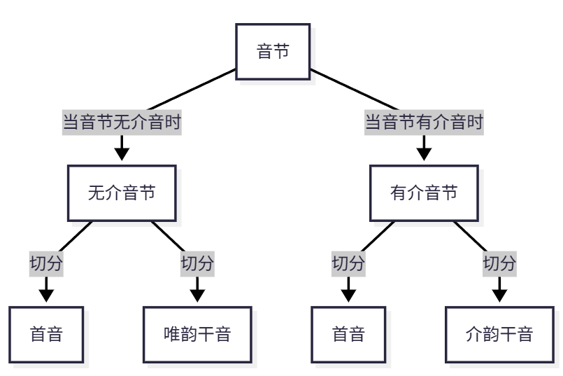
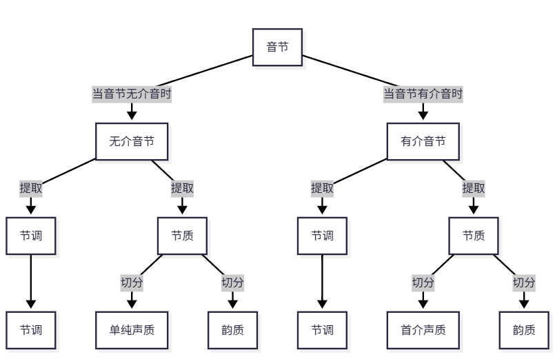
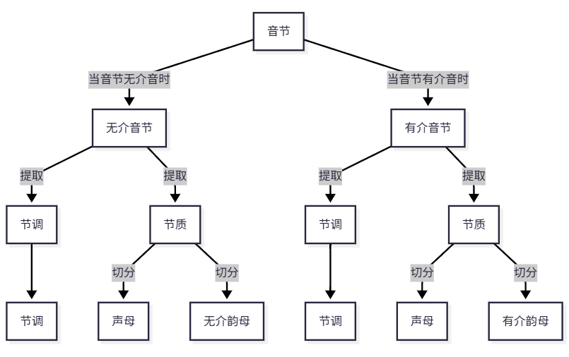
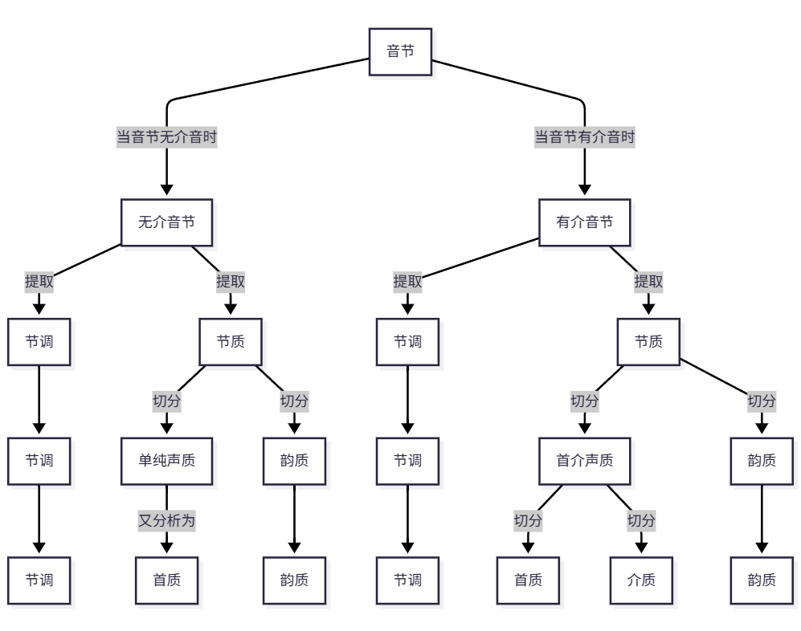
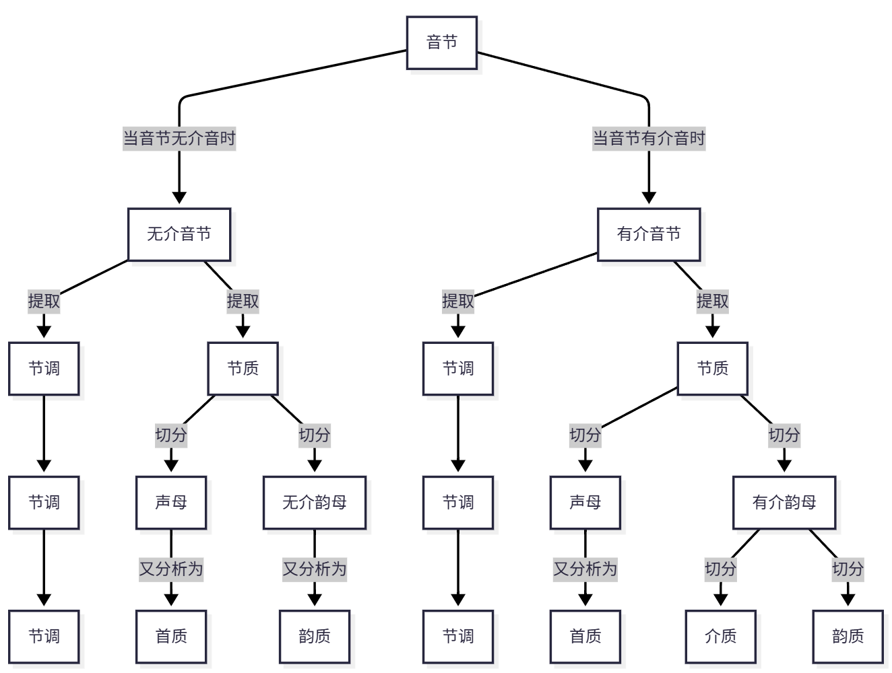
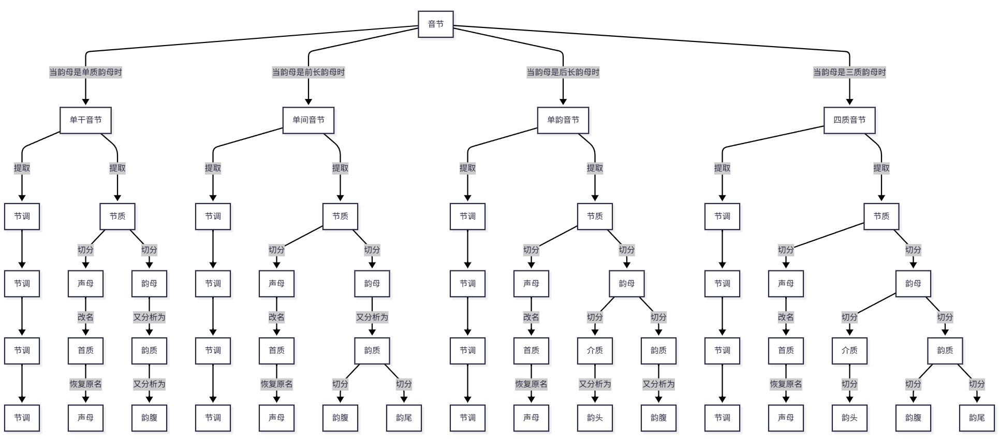

# 已有析音法

析音法是分析语音的方法。分析语音，就是对语音作分析，被简称为析音。因此，分析语音的方法被简称为析音法。在汉语中，在学术上，析音法过去通常被称呼为语音分析法或音节分析法。

在汉语中，析音的基本内容是分析音节。在汉语中，古人析音，基本内容就是分析音节，通常轻视、甚至忽视分析除音节外的内容，例如很少分析包含在复音词句内的音节的变音、变调、轻音、重音等等语音现象。在汉语中，今人析音，尽管既分析音节，又分析包含在复音词句内的音节的变音、变调、轻音、重音等等语音现象，还分析语句的语调、韵律等等语音现象，但基本内容仍是分析音节。因此，在汉语中，分析音节是语音分析的基本内容[🔍 (林焘-耿振声-2004)](文献.md#ref-林焘-耿振声-2004)。

在汉语中，分析音节是分析其它语音现象的前提。在某些语言例如英语中，分析语音通常不必首先析出和分析音节。因此，在这些语言中，分析音节通常不是分析其它语音现象的前提。然而，在汉语中，分析语音通常首先析出和分析音节，然后才以对音节所作的分析为基础分析其它语音现象。这就是说，在汉语中，分析音节不仅仅是语音分析的基本内容而且也是分析其它语音现象的前提。因此，在汉语中，语音分析是以音节分析为前提的语音分析，分析音节是分析其它语音现象的前提。

在汉语中，把分析音节作为语音分析的基本内容和分析其它语音现象的前提，是由汉语的音义关系的基本特征决定的。在汉语中，音节分为有义音节和无义音节两类。有义音节就是单音节语素的语音，包含那些只被用作拟声语素的音节。无义音节是指虽则在多音节语素中存在但却并不表示任何单音节语素的语音的音节。在汉语中，既不出现在多音节语素中也不是任何单音节语素的语音的音节是不存在的。因此，准确地说，无义音节是指那些从多音节语素中分离出来孤立地看不是任何一个单音节语素的语音的有音无义的音节。例如，在“尴尬”这个双音节单语素词(双音节单纯词)中，“尬”的字音，在频繁地被用来表示尬笑、尬聊、尬黑、尬舞、尬演、尬住和不尴不尬等等词语的“尬”前，就是一个无义音节。在汉语中，只有数量极少甚至可以忽略不计的个别音节是无义音节。无义音节的归宿不外三种情况：一、因被当成单音节语素使用而变成有义音节。例如，“尬”的字音，原本只是一个有音无义的音节，但近些年来在频繁地被用来表示尬笑、尬聊、尬黑、尬舞、尬演、尬住和不尴不尬等等词语的“尬”后，却变成了一个具有“尴尬”这个义项的有义音节。二、因一向不被当成单音节语素使用导致使用频率越来越低而渐渐消亡。就算是有义音节例如“挼”的字音也存在这种情况，何况是那些从来不被用来表示任何语义的无义音节。三、因被当成拟声语素使用具有模拟某个声音的义项而变成有义音节。由于语言具有能产性，因此，在汉语中，一个无义音节即使从未被当成拟声语素用过，也不能确定它将来一定不会被当成拟声语素来用。因此，每个无义音节尽管不是现实的有义音节但却都是潜在的有义音节。因而，在现代通用汉语中，由于语言具有能产性，音节不是现实的有义音节就是潜在的有义音节、没有无义音节[📝[1]](注释.md#footnote-1)。这就是说，由于语言具有能产性，音节不是现实的单音节语素的语音就是潜在的单音节语素的语音。因此，分析音节就是分析现实的和潜在的有义音节，就是分析表现为音节的现实的和潜在的最小表义单位——单音节语素的语音，简单地说，就是分析单音节语素的语音。因此，分析汉语语音系统，只有从表现为音节的最小表义单位——单音节语素的语音入手[🔍 (王理嘉-1991)](文献.md#ref-王理嘉-1991)，才能系统而又准确地体现汉语音义关系的基本特征。

在汉语中，在汉字系统形成后，分析音节就是分析字音。在汉字系统中，把记录同一语素的不同汉字算作同一汉字的不同形式并选出一个通用字、把记录不同语素的同一汉字算作不同汉字，音同而义别的汉字构成一个同音字集，音节就是同音字集的字音。因此，在汉字系统形成后，音节就是字音[📝[2]](注释.md#footnote-2)，因而，分析音节就是分析字音[📝[3]](注释.md#footnote-3)。因此，在汉语中，只有字音才是语音分析的基本内容，分析语音系统首先就是分析字音[🔍 (王洪君-1999)](文献.md#ref-王洪君-1999)，而不是和在某些语言例如英语中一样首先分析词的语音。事实证明，在韵学韵书形成后，分析音节就是分析字音。在韵学韵书形成后，古人在韵学韵书中把同音字集称为小韵。因此，在韵学韵书中，音节就是小韵的字音。小韵的字音是韵学和韵书的分析对象。因此，在韵学韵书形成后，古人在韵学韵书中分析小韵的字音，就是分析音节。

根据析音法的典型特征分类，已有析音法分成二分法、一调二质分析法、一调三质分析法和节调质素分析法四类。根据析音法的演变历程分代，已有析音法分成第一代析音法、第二代析音法、第三代析音法和第四代析音法四代。第四代析音法是节调质素分析法。第四代析音法是现行析音法。

节调质素分析法是现行析音法。节调质素分析法是制定《汉语拼音方案》的根据。这就是说，《汉语拼音方案》的语音系统是根据节调质素分析法构建的以质位和调位为音位的音位系统。通俗地说，《汉语拼音方案》根据节调质素分析拼音。《汉语拼音方案》是现行拼音方案。因此，节调质素分析法是现行析音法。

节调质素分析法是把音节分析成由节调与节质构成的音节并且把节质切分成质素序列的方法。在经过节调质素分析后，音节由节调与节质构成，节质在不省略零声母的情况下由声母和韵母构成，韵母分成单质韵母、前长韵母、后长韵母和三质韵母四类。单质韵母由韵腹充当，是单纯音质韵母的简称。前长韵母由韵腹和韵尾构成，是前长二合音质韵母的简称。后长韵母由韵头和韵腹构成，是后长二合音质韵母的简称。三质韵母由韵头、韵腹和韵尾构成，是三合音质韵母的简称。单质韵母、前长韵母、后长韵母和三质韵母，一一对应，依序就是根据韵头有无和韵尾有无分类分出的无头无尾韵母、无头有尾韵母、有头无尾韵母和有头有尾韵母。单质韵母和前长韵母，也就是说，无头无尾韵母和无头有尾韵母，被统称为无头韵母。后长韵母和三质韵母，也就是说，有头无尾韵母和有头有尾韵母，被统称为有头韵母。在节调质素音节中，在把声母、有头韵母的韵头、每类韵母的韵腹和有尾韵母的韵尾都分析成“音素”后，音节是由节调与充当声母和构成韵母的“音素”构成的音节。然而，在这种由节调与充当声母和构成韵母的“音素”构成的音节中，无论是先析出节调还是后析出节调，只要析出节调，在析出节调后，“音素”已不再是从音质的角度划分出来的最小音段、而仅仅是根据音质的差异从由声母和韵母构成的节质中析出的只表示音质不表示音调的最小音质，简单地说，“音素”只不过是音素的音质，因此，把音素的音质命名为“质素”，“音素”实际上是质素，音节实际上是由节调与构成节质的质素序列构成的音节。这种音节被简称为节调质素音节。这种把音节分析成节调质素音节的方法，就是节调质素分析法。

在根据节调质素分析拼音时，常人实际使用的拼音方法都不是真正的根据质调关系的内容拼音的方法。根据节调质素分析拼音必须根据质调关系的内容拼音。只有确定与质素联结的调段的音调，才能根据质调关系的内容拼音。确定与质素联结的调段的音调，就是确定与充当声母和构成韵母的质素相联结的调段的音调。当声母是清音时，与声母联结的调段是零；当声母是浊音时，与声母联结的调段非零。然而，不论声母清浊，与声母联结的调段都不是节调的区别特征且都与声母相对独立，因此，简单地说，当声母是浊音时，与声母联结的调段的音调受与韵母联结的调段制约、由与韵母联结的调段逆同化动态确定。因此，在确定与质素联结的调段的音调时，不论声母清浊，都不必具体确定与声母联结的调段的音调。因此，确定与质素联结的调段的音调，只需确定与构成韵母的质素相联结的调段的音调。然而，根据节调质素分析法不能全面而又具体地确定与构成韵母的质素相联结的调段的音调。因此，根据节调质素分析法不能全面而又具体地确定与质素相联结的调段的音调。简单地说，根据节调质素分析法不能全面而又具体地确定质调关系的内容。这导致常人实际使用的拼音方法都不是真正的根据质调关系的内容拼音的方法。这是节调质素分析法的问题。

## 已有各式析音法的分类

根据析音法的典型特征分类，已有析音法分成二分法、一调二质分析法、一调三质分析法和节调质素分析法四类。二分法或指把音节分析成由一前和一后两个音段构成的音节的方法或指把音节分析成由节调与节质两个特征构成的音节的方法。一调二质分析法是把音节分析成由节调与节质构成的音节并且把节质或切分成声质和韵质或切分成声母和韵母两段音质的方法。一调三质分析法是把音节分析成由节调与节质构成的音节并且当音节无介音时把节质切分成首质和韵质两段音质当音节有介音时把节质切分成首质、介质和韵质三段音质的方法。节调质素分析法是把音节分析成由节调与节质构成的音节并且把节质切分成质素序列的方法。

### 各类各式二分法

在已有析音法中，二分法共有两类：一类是两段二分法，一类是质调二分法。两段二分法是把音节分析成或由声段和韵段或由首音和干音两个音段构成的音节的方法。质调二分法是指把音节分析成由节调与节质构成的音节的方法。

#### 两段二分法

两段二分法共有两种：一种是声韵二分法，一种是首干二分法。声韵二分法是把音节分析成由声段和韵段构成的音节的方法。首干二分法是把音节分析成由首音和干音构成的音节的方法。

##### 声韵二分法

声韵二分法是把音节分析成由声段和韵段构成的音节的方法。在汉语中，从词源上说明，“韵”本义指韵语及韵文的韵。它是古人根据韵语及韵文的用韵实践从音节中最先分析出来的一类音段。在切出了韵后，古人把从音节中切除了韵以后剩下的音段整体分析成“声”，把音节分析成由声和韵构成的音节[📝[4]](注释.md#footnote-4)。这种析音法就是声韵二分法。“声”和“韵”是古人使用的术语，在现代通用汉语中，顺应现代汉语双音节化的趋势，依序被改名为“声段”和“韵段”，以免产生歧义。在把“声”和“韵”改名为声段和韵段后，把音节分析成由声和韵构成的音节，就是把音节分析成由声段和韵段构成的音节。因此，声韵二分法是把音节分析成由声段和韵段构成的音节的方法。

在声韵二分法中，分析结果是由声段和韵段构成的音节。这个结果根据记音实践从形式上用列表来表示，换句话说，音节的结构通式，记成：

$$
\begin{bmatrix}
声段 & 韵段
\end{bmatrix}
$$

在声韵二分法中，分析对象和分析结果的关系，也就是说，分析过程，用等式来表示，记成：

$$
音节 = \begin{bmatrix}
声段 & 韵段
\end{bmatrix}
$$

这个表示声韵二分法的析音过程的等式，被命名为声韵二分法的一般程式或分析模型。顺便说明，在说明各式析音法时，表示作为分析对象的音节和作为分析结果的音节的关系的等式，被统称为分析程式且常被简称为程式。

在声韵二分法中，根据声段是否首音，把由首音充当的声段也就是说把既充当首音又充当声段的辅音简称为单纯声段，把由首介合音充当的声段简称为首介声段，声段分成单纯声段和首介声段两类。声段和首音不尽相同。首音就是节首辅音，指从音节中切除了韵段或介韵合音以后剩下的辅音。介音特指介居在首音和韵段间的高元音。顺便说明，根据音节有无介音，音节分成无介音节和有介音节两类。介韵合音由介音和韵段合成。首介合音由首音和介音构成，因首音都由辅音充当，又被称为辅介合音。强调说明，在汉语中，古人在析音时最初既不把首介合音切分成首音和介音两段，也不把介韵合音整体切分成一个音段，而是把首介合音整体切分成一个音段并分析成与单纯声段不同的另外一类声段。

在把声段划分成单纯声段和首介声段两类后，根据音节分成无介音节和有介音节两类，两类音节的析音过程，也就是说，声韵二分法的析音过程图示如图 2.1‑1。

![声韵二分法的析音过程]
**图 2.1‑1 声韵二分法的析音过程**

根据声段是单纯声段或首介声段，声韵二分法的具体程式记成：

$$
音节 =
\begin{cases}
\begin{bmatrix}
单纯声段 & 韵段
\end{bmatrix} ， 当音节无介音时 \\[6pt]
\begin{bmatrix}
首介声段 & 韵段
\end{bmatrix} ， 当音节有介音时
\end{cases}
$$

根据这个程式可知：声段或由首音充当或由首介合音充当。韵段是指从音节中切除了声段以后剩下的音段，是所有同韵的音节共同具有的音调和音质都相同的音段(全类同调同部相押的音节共同具有的音段)。具体地说，当音节无介音时，韵段是音节的除首音外的音段；当音节有介音时，韵段是音节的除首介合音外的音段[📝[5]](注释.md#footnote-5)。

根据反切解说，声韵二分法就是汉末曹魏孙炎在编撰《〈尔雅〉音义》时使用的析音法。换句话说，声韵二分法就是，古人，在制作反切时，不论音节有无介音都把音节划分成声段和韵段两段，也就是说，把首音或首介合音分析成声段，把音节的除声段外的音段分析成韵段，并用反切上字和反切下字来记录声段和韵段的两段二分法。因此，根据古人，在按照声韵二分法制作反切时，把由反切上字所记录的声段统称为“声”[📝[6]](注释.md#footnote-6)、把由反切下字所记录的韵段统称为“韵”[📝[7]](注释.md#footnote-7)，音节记成：

$$
音节 = \begin{bmatrix}
声 & 韵
\end{bmatrix}
$$

根据这个程式可知，声韵二分法就是古人在制作反切时使用的把音节分析成由声和韵构成的音节的方法。然而，在学术上，“声”和“韵”这对术语的用法通常都是不专一的[📝[8]](注释.md#footnote-8)，存在多种不同的用法，甚至存在两者混用的情况。因此，说明声韵二分法，只有把声韵二分法的“声”和“韵”与非声韵二分法的“声”和“韵”区别开来，才能避免歧义。简便和有效的区别方法就是改变声韵二分法的“声”和“韵”的名称。换句话说，说明声韵二分法，若要防止产生歧义和避免把说明淹没在对“声”和“韵”这对术语的不同用法的冗繁考据、辨析、剔择和注解中，只要简单地用一对新的术语来替换声韵二分法的“声”和“韵”，就能达到目的。因此，说明声韵二分法，引入声段和韵段这对新的术语，用声段来指称由反切上字所记录的“声”、用韵段来指称由反切下字所记录的“韵”，也就是说，把声韵二分法的“声”和“韵”改名为声段和韵段。因此，在把“声”和“韵”改名为声段和韵段后，声韵二分法就是古人在制作反切时使用的把音节分析成由声段和韵段构成的音节的方法。

##### 首干二分法

首干二分法是把音节分析成由首音和干音构成的音节的方法。在声韵二分法形成后，在声段是单纯声段的音节中，把声段和韵段改名为首音和干音；在声段是首介声段的音节中，把声段切分成首音和介音两段，并把由介音和韵段合成的介韵合音整体切分成一个音段且命名为干音；这种把音节分析成由首音和干音构成的音节的方法就是首干二分法。首干二分法的一般程式记成：

$$
音节 = \begin{bmatrix}
首音 & 干音
\end{bmatrix}
$$

在首干二分法中，根据干音是否由韵段充当，把由韵段充当的干音也就是说把既充当韵段又充当干音的音节的除首音外的音段简称为唯韵干音，把由介韵合音充当的干音简称为介韵干音，干音分成唯韵干音和介韵干音两类。干音和韵段不尽相同。干音或指韵段或指由介音和韵段合成的介韵合音。具体地说，当音节无介音时，韵段既是韵段又是干音。然而，当音节有介音时，韵段不是干音；干音包含介音、是介韵合音；韵段不含介音、是构成干音的除介音外的音段。

在把干音划分成唯韵干音和介韵干音两类后，根据音节分成无介音节和有介音节两类，两类音节的析音过程，也就是说，首干二分法的分析过程图示如图 2.1‑2。

**图 2.1‑2 首干二分法的分析过程**

根据干音是唯韵干音或介韵干音，首干二分法的具体程式记成：

$$
音节 = \begin{cases}
\begin{bmatrix}
首音 & 唯韵干音
\end{bmatrix} ， 当音节无介音时 \\[6pt]
\begin{bmatrix}
首音 & 介韵干音
\end{bmatrix} ， 当音节有介音时
\end{cases}
$$

根据这个程式可知：首音指音节的除干音外的节首辅音。干音是音节的除首音外的音段。干音当音节无介音时由韵段充当，当音节有介音时由介韵合音充当。

根据反切解说，首干二分法就是古人在根据韵图制作反切时使用的字母等韵分析法。换句话说，首干二分法就是，古人，在根据韵图制作反切时，把音节划分成“字母”和“等韵”两段，不论音节有无介音都把首音分析成“字母”、把干音分析成“等韵”，也就是说，当音节无介音时把韵段分析成“等韵”，当音节有介音时把介韵合音分析成“等韵”，并用反切上字和反切下字来记录“字母”和“等韵”的两段二分法。因此，根据古人在根据韵图制作反切时把首音分析成“字母”、把干音分析成“等韵”，音节记成：

$$
音节 = \begin{bmatrix}
字母 & 等韵
\end{bmatrix}
$$

根据这个程式可知，首干二分法就是字母等韵分析法，就是古人在根据韵图制作反切时使用的把音节分析成由“字母”和“等韵”构成的音节的方法。尽管古人在根据韵图制作反切时分别用“字母”和“等韵”来指称首音和干音。然而，在清朝中期后，在学术上，主流的看法是用“字母”来指称首音名不副实，因此，根据“字母”实际上是首音，把“字母”改名为首音。在把“字母”改名为首音后，沿用“等韵”这个术语也无必要。因此，“等韵”被改名为干音。因此，字母等韵分析法被改名为首干二分法。

比较声韵二分法和首干二分法的具体程式可知，把音节分析成由两个音段构成的音节，当音节无介音时，声段就是首音、韵段就是干音，分段方法是相同的，都是把音节分析成声段和韵段或首音和干音两段。然而，当音节有介音时，分段方法却有两种：一种是把首介合音整体分析成声段，一种是把介韵合音整体分析成干音。这种差异是划分声韵二分法和首干二分法的根据。因此，在已有各式析音法中，两段二分法共有两种：一种是声韵二分法，一种是首干二分法，换句话说，声韵二分法和首干二分法合称两段二分法。声韵二分法是把音节分析成由声段和韵段构成的音节的方法。声段或由首音充当或由首介合音充当。韵段是指从音节中切除了声段以后剩下的音段，是所有同韵的音节共同具有的音调和音质都相同的音段(全类同调同部相押的音节共同具有的音段)。首干二分法是把音节分析成由首音和干音构成的音节的方法。首音就是节首辅音，指从音节中切除了韵段或介韵合音以后剩下的辅音。干音是音节的除首音外的音段。干音当音节无介音时由韵段充当，当音节有介音时由介韵合音充当。声韵二分法和首干二分法是两种形式的两段二分法，两者又名一式两段二分法和二式两段二分法，两者统称两段二分法。

综述说明，两段二分法是把音节分析成或由声段和韵段或由首音和干音两个音段构成的音节的方法。声韵二分法是把音节分析成由声段和韵段构成的音节的方法。首干二分法是把音节分析成由首音和干音构成的音节的方法。

#### 质调二分法

质调二分法是指把音节分析成由节调与节质构成的音节的方法。节调是音节的音调的简称。在把音节的声调简称为节调后，把音节的音质简称为节质。声调语言分成单音节声调语言和多音节声调语言两类。汉语是单音节声调语言[📝[9]](注释.md#footnote-9)。在多音节声调语言中，声调表现为音节数量不定的语素、词语等语言单位的音调。然而，在汉语中，声调总是表现为音节数量唯一的单音节语素或单音节词的音调，换句话说，声调总是表现为音节的声调，具体地说，排除因受前后音节的声调等外部影响而发生的变调情况，每个音节都有且仅有一个声调。因此，在强调汉语的声调与多音节声调语言的声调在形式上不同、是一类特殊形式的声调——音节的声调并专门用一个术语来指称这类语言的声调时，根据汉语的声调表现为音节的声调并把音节的声调简称为节调，汉语的声调就是“节调”。在汉语中，节调和节质的差异都构成对立。因此，在析音时，一种方法是从音节中既析出节调又析出节质、把音节分析成由节调与节质构成的音节。这种析音法就是质调二分法。根据质调二分法，音节记成：

$$
\begin{matrix}
音节 = \begin{bmatrix}
节调 \\
节质
\end{bmatrix}
\end{matrix}
$$

在汉语中，根据是否把音节分析成离散的音段序列，析音法分成一维音段序列分析法和二维质调序列分析法两类。在汉语中，节调和节质的差异都构成对立。因此，在已有析音法中，既有把音节分析成由两个音段构成的音节、把节调划分成两段、分析成构成音节的两个音段的音调的，例如声韵二分法和首干二分法；也有把节调分析成与节质相对独立的音节的特征的，例如一调二质分析法、一调三质分析法和节调质素分析法。在两段二分法中，节调或被分析成声段的音调和韵段的音调两段或被分析成首音的音调和干音的音调两段，也就是说，节调被分析成两个音段的特征，因此，这类析音法是一维音段序列分析法。在把节调分析成与节质相对独立的特征后，不论把节质划分成几段，这类析音法根据音节由节调与节质构成都是二维质调序列分析法。这就是说，一调二质分析法、一调三质分析法和节调质素分析法都是二维质调序列分析法。

两段二分法的特征是从时域上把音节分析成或由声段和韵段或由首音和干音构成的音节。在声韵二分法中，声段和韵段同属音段，音节是由声段和韵段构成的音节。在首干二分法中，首音和干音同属音段，音节是由首音和干音构成的音节。

二维质调序列分析法的特征是把音节分析成由节调与节质构成的音节，且把节质或一律划分成两段音质、或至多划分成三段音质、或一律切分成质素序列。例如，在节调声质韵质分析中，音节由节调与节质构成，节质由声质和韵质构成，因此，节调声质韵质分析法是一种二维质调序列分析法。又如，在节调声母韵母分析中，音节由节调与节质构成，节质由声母和韵母构成，因此，节调声母韵母分析法是一种二维质调序列分析法。再如，在节调质素分析法中，音节由节调与节质构成，节质由质素构成的序列，因此，节调质素分析法是一类二维质调序列分析法。

两段二分法与一调二质分析法表示节调的方式不同。在两段二分法中，节调间接或用声段的音调和韵段的音调来表达或用首音的音调和干音的音调来表达。然而，在一调二质分析法中，节调与节质相对独立，节调是构成音节的与音质相对独立的结构单元。例如，在节调声母韵母分析中，节调与节质相对独立，节调是构成音节的与音质相对独立的结构单元；声母和韵母构成节质；节调与节质构成音节；节调不用也不能用声母的音调和韵母的音调来表达。

综述说明，二分法分为两段二分法和质调二分法两类。

### 一调二质分析法

一调二质分析法是把音节分析成由节调与节质构成的音节并且把节质或切分成声质和韵质或切分成声母和韵母两段音质的方法。一种是节调声质韵质分析法，一种是节调声母韵母分析法。前者把节质一律划分成声质和韵质两段，后者把节质一律划分成声母和韵母两段。两者都把音节分析成由一个声调与两段音质构成的音节。因此，两者被统称为一调二质分析法。

#### 节调声质韵质分析法

在声韵二分法形成后，节调声质韵质分析法是从由声段和韵段构成的音节中析出节调且把声段的音质分析成声质、把韵段的音质分析成韵质的方法。

节调声质韵质分析法的一般程式记成：

$$
音节 = \begin{bmatrix}
\begin{matrix}
节 &&& 调
\end{matrix} \\
\begin{matrix}
声质 & 韵质
\end{matrix}
\end{bmatrix}
$$

在节调声质韵质分析中，当声质是单纯声段的音质时，把单纯声段的音质简称为首质，把由首质充当的声质也就是说把既是首质又是声质的单纯声段的音质简称为单纯声质；当声质是首介声段的音质时，把由首介声段的音质充当的声质简称为首介声质；声质分成单纯声质和首介声质两类。

在把声质划分成单纯声质和首介声质两类后，根据音节分成无介音节和有介音节两类，两类音节的析音过程，也就是说，节调声质韵质分析法的分析过程图示如图 2.1‑3。

**图 2.1‑3 节调声质韵质分析法**

在把声质划分成单纯声质和首介声质两类后，节调声质韵质分析法的具体程式记成：

$$
音节 = \begin{cases}
\begin{bmatrix}
\begin{matrix}
节 &&&&& 调
\end{matrix} \\
\begin{matrix}
单纯声质 & 韵质
\end{matrix}
\end{bmatrix} ， 当音节无介音时 \\[12pt]
\begin{bmatrix}
\begin{matrix}
节 &&&&& 调
\end{matrix} \\
\begin{matrix}
首介声质 & 韵质
\end{matrix}
\end{bmatrix} ， 当音节有介音时
\end{cases}
$$

在节调声质韵质分析中，在析出节调后，声质和韵质构成节质，节调与节质既相对独立又通过并行联结关系构成音节。因此，严格地说，单纯声质不是单纯声段而是单纯声段的音质；首介声质不是首介声段而是首介声段的音质。无论音节是哪类音节，韵质都不是韵段而是韵段的音质。

强调说明，前人，在说明节调声质韵质分析法时，不是使用节调、声质和韵质这套术语，而是使用声母、韵母和声调这套术语，并且经常把三者简称为“声”、“韵”和“调”，从而把这种析音法简称为“声韵调分析法”。然而，在节调声质韵质分析中，在使用声母和韵母这对术语的情况下，声母和韵母只不过是声韵二分法的“声”和“韵”的音质。因此，在节调声质韵质分析中，尽管完全可以和前人一样依序把声段的音质和韵段的音质命名为声母和韵母，但却不能依次把声母和韵母简称为“声”和“韵”。在根据节调声质韵质分析法析音时，无论是先析出节调还是后析出节调，只要析出节调，在析出节调后，就从声段和韵段中析出了各自具有的那段作为构成节调的一个调段的音调，因此，在节调声质韵质分析中，声母和韵母已不再是声段和韵段而是声段的音质和韵段的音质。因此，在把声段的音质和韵段的音质简称为声质和韵质后，只有把声母和韵母改名为声质和韵质才算名符其实。同时，在说明节调声母韵母分析法时，前人也使用声母、韵母和声调这套术语。因此，为使术语名符其实，为严格区分两式一调二质分析法的声母和韵母，在说明节调声质韵质分析法时，不再使用声母、韵母和声调这套术语及其简称，不再使用“声韵调分析法”这个术语，把这种形式的“声韵调分析法”改名为节调声质韵质分析法。

#### 节调声母韵母分析法

在首干二分法形成后，节调声母韵母分析法是从由首音和干音构成的音节中析出节调且把首音的音质分析成声母、把干音的音质分析成韵母的方法。

节调声母韵母分析法的一般程式记成：

$$
音节 = \begin{bmatrix}
\begin{matrix}
节 &&& 调
\end{matrix} \\
\begin{matrix}
声母 & 韵母
\end{matrix}
\end{bmatrix}
$$

在节调声母韵母分析中，当韵母是唯韵干音的音质时，把唯韵干音的音质简称为韵质，把由唯韵干音的音质充当的韵母也就是说把既是韵质又是韵母的节质的除声母外的音质简称为无介韵母；当韵母是介韵干音的音质时，把由介韵干音的音质充当的韵母简称为有介韵母；韵母分成无介韵母和有介韵母两类。

强调说明，前人，在说明节调声母韵母分析法时，和说明节调声质韵质分析法一样，也使用声母、韵母和声调这套术语，也把三者简称为“声”、“韵”和“调”，从而也把这种析音法简称为“声韵调分析法”。然而，两式一调二质分析法的声母和韵母的内涵和外延(指称对象)不尽相同。在节调声质韵质分析中，声母或指单纯声段的音质或指首介声段的音质，无论音节有无介音，韵母都指韵质。然而，在节调声母韵母分析中，无论音节有无介音，声母都指首音的音质，韵母都指干音的音质。具体地说，当音节无介音时韵母指韵段的音质、当音节有介音时韵母指介韵合音的音质。在根据节调声母韵母分析法析音时，无论是先析出节调还是后析出节调，只要析出节调，在析出节调后，就从首音和干音中析出了各自具有的那段作为构成节调的一个调段的音调，因此，在节调声母韵母分析中，声母和韵母已不再是首音和干音而是首音的音质和干音的音质。因此，为严格区分两式一调二质分析法的声母和韵母，不再把节调声质韵质分析法的声质和韵质称为声母和韵母，只把节调声母韵母分析法的指称首音的音质和干音的音质的声母和韵母仍旧称为声母和韵母。因此，节调声母韵母分析法是从由首音和干音构成的音节中析出节调且把首音的音质分析成声母、把干音的音质分析成韵母的方法。在说明节调声母韵母分析法时，把声母和韵母简称为“声”和“韵”会导致两者与声韵二分法的“声”和“韵”相混，因此，不能把声母和韵母简称为“声”和“韵”，因此，在说明这种析音法时，不再使用“声韵调分析法”这个术语，把这种形式的“声韵调分析法”改名为节调声母韵母分析法。

在把韵母划分成无介韵母和有介韵母两类后，根据音节分成无介音节和有介音节两类，两类音节的析音过程，也就是说，节调声母韵母分析法的分析过程图示如图 2.1‑4。

**图 2.1‑4 节调声母韵母分析法**

在把韵母划分成无介韵母和有介韵母两类后，节调声母韵母分析法的具体程式记成：

$$
音节 = \begin{cases}
\begin{bmatrix}
\begin{matrix}
节 &&&&& 调
\end{matrix} \\
\begin{matrix}
声母 & 无介韵母
\end{matrix}
\end{bmatrix} ， 当音节无介音时 \\[12pt]
\begin{bmatrix}
\begin{matrix}
节 &&&&& 调
\end{matrix} \\
\begin{matrix}
声母 & 有介韵母
\end{matrix}
\end{bmatrix} ， 当音节有介音时
\end{cases}
$$

在节调声母韵母分析中，在析出节调后，无论音节是哪类音节，声母严格地说都不是首音而是首音的音质；当音节无介音时，无介韵母不是唯韵干音而是唯韵干音的音质；当音节有介音时，有介韵母不是介韵干音而是介韵干音的音质。

一调二质分析法是一类二维质调序列分析法。在两式一调二质分析法中，节调与节质既相对独立又通过并行联结关系构成音节，准确地说，节调是与节质相联结的音调。在节调声质韵质分析中，声质和韵质构成节质。在节调声母韵母分析中，声母和韵母构成节质。在两式一调二质分析法中，音节内部的组合关系分为两个层次：在节调声质韵质分析中，第一层、声质和韵质构成节质；第二层、节调与节质构成音节。在节调声母韵母分析中，第一层、声母和韵母构成节质；第二层、节调与节质构成音节。因此，一调二质分析法是一类二维质调序列分析法。

综述可知，一调二质分析法是把音节分析成由节调与节质构成的音节并且把节质或切分成声质和韵质或切分成声母和韵母两段音质的方法。节调声质韵质分析法和节调声母韵母分析法的差异是：在节调声质韵质分析中，当音节无介音时把单纯声段的音质分析成声质、把韵段的音质分析成韵质，当音节有介音时把首介声段的音质分析成声质、把韵段的音质分析成韵质。在节调声母韵母分析中，不论音节有无介音都把首音的音质分析成声母，当音节无介音时把唯韵干音的音质分析成韵母、当音节有介音时把介韵干音的音质分析成韵母。

### 一调三质分析法

一调三质分析法是把音节分析成由节调与节质构成的音节并且当音节无介音时把节质切分成首质和韵质两段音质当音节有介音时把节质切分成首质、介质和韵质三段音质的方法。简单地说，一调三质分析法是把音节分析成由节调与节质构成的音节并且把节质切分成至多三段音质——首质、介质和韵质的方法；其中，首质或介质是可有可无的，节调和韵质是必不可少的。

首质是首音的音质的简称。首质在《注音符号方案》中被定名为声母。把声母改名为首质，是为从术语上突出显示首质与介质和韵质一样都是构成节质的一段音质。首质根据有无是否构成对立分成实首质和虚首质两类。实首质就是非零声母。虚首质就是零声母。

介质是介音的音质的简称。介质在《注音符号方案》中被定名为介母，在解说《汉语拼音方案》时被改名为韵头。

韵质是韵段的音质的简称。韵质在《注音符号方案》中被定名为韵母，在解说《汉语拼音方案》时被改名为韵身，在生成音系学中被改名为韵基。

在经过一调三质分析后，具体地说，音节必有节调和韵质，有些音节既无首质也无介质，有些音节虽无首质但有介质，有些音节虽有首质但无介质，有些音节既有首质也有介质。因此，这种当音节既无首质也无介质时把音节分析成由节调与韵质构成的音节，当音节虽无首质但有介质时把音节分析成由节调与介质和韵质构成的音节，当音节虽有首质但无介质时把音节分析成由节调与首质和韵质构成的音节和当音节既有首质也有介质时把音节分析成由节调与首质、介质和韵质构成的音节的方法；由于组成部分最多的音节由一个节调与三段音质首质、介质和韵质构成，被简称为“一调三质分析法”。

强调说明，前人，在说明一调三质分析法时，并不用首质、介质、韵质和节调这套术语，而是用声母、介母、韵母和声调这套术语，并把四者简称为“声”、“介”、“韵”和“调”，从而把这种析音法简称为“声介韵调分析法”。然而，一方面，把声母和韵母简称为“声”和“韵”会导致两者与声韵二分法的“声”和“韵”相混；另方面，把介母简称为“介”会导致介母和介音相混。因此，不能把声母、介母和韵母简称为“声”、“介”、“韵”，因此，在说明这种析音法时，不再使用“声介韵调分析法”这个术语，把这种形式的析音法改名为“一调三质分析法”。

根据一调二质分析法分成节调声质韵质分析法和节调声母韵母分析法两种可知，在一调二质分析法形成后，一调三质分析法既指在节调声质韵质分析法基础上把单纯声质分析成首质、把首介声质切分成首质和介质两段的方法，也指在节调声母韵母分析法基础上把声母分析成首质、把无介韵母分析成韵质、把有介韵母划分成介质和韵质两段的方法。

在节调声质韵质分析法基础上把单纯声质分析成首质、把首介声质切分成首质和介质两段的过程图示如图 2.1‑5。

**图 2.1‑5 在节调声质韵质分析法基础上分出首质和介质的过程**

一调三质分析法的一般程式记成：

$$
音节 = \begin{cases}
\begin{bmatrix}
\begin{matrix}
节 &&&&&& 调
\end{matrix} \\
\begin{matrix}
首质 & 韵 &&& 质
\end{matrix}
\end{bmatrix}， & 当音节无介音时 \\[12pt]
\begin{bmatrix}
\begin{matrix}
节 &&&&&& 调
\end{matrix} \\
\begin{matrix}
首质 & 介质 & 韵质
\end{matrix}
\end{bmatrix}， & 当音节有介音时
\end{cases}
$$

在节调声母韵母分析法基础上把声母分析成首质、把无介韵母分析成韵质、把有介韵母划分成介质和韵质两段的过程图示如图 2.1‑6。

**图 2.1‑6 在节调声母韵母分析法基础上分出介质和韵质的过程**

根据在节调声质韵质分析法基础上分出首质和介质的过程和在节调声母韵母分析法基础上分出介质和韵质的过程可知，这两个分析过程异曲同工，尽管中间环节因介质的有无不同而不同，然而，由于两者的分析对象相同(都是未经分解的音节)和分析结果相同(都是把音节分析成由节调与节质构成的音节并且当音节无介音时把节质切分成首质和韵质两段音质当音节有介音时把节质切分成首质、介质和韵质三段音质)。因此，从这两个分析过程中省去中间环节，这两个分析过程的分析程式完全相同。

在一调三质分析中，根据介质有无及介质差异分类，韵母分成无介韵母、噫介韵母、呜介韵母和吁介韵母四类。根据韵母是否由介质和韵质构成分类，韵母分成无介韵母和有介韵母两类。无介韵母由韵质充当，没有介质。有介韵母由介质和韵质构成，具有介质。根据介质差异分类，有介韵母分成介质为 i[i]的韵母、介质为 u[u]的韵母和介质为 ü[ʏ]的韵母三类，依序被命名为“噫介韵母”、“呜介韵母”和“吁介韵母”。因此，根据介质有无及介质差异分类，韵母分成无介韵母、噫介韵母、呜介韵母和吁介韵母四类。

在一调三质分析中，音节分成无介音节和有介音节两类。当音节无介音时，节质由声母和韵母构成，声母由首质充当，韵母由韵质充当，首质和韵质构成节质，节调与节质构成音节，这类音节被简称为无介音节。当音节无介音时，节质由声母和韵母构成，声母由首质充当，韵母由介质和韵质构成，首质、介质和韵质构成节质，节调与节质构成音节，这类音节被简称为有介音节。

一调三质分析法是一种二维质调序列分析法。在一调三质分析中，节调与节质既相对独立又通过并行联结关系构成音节，准确地说，节调是与节质相联结的音调。音节内部的组合关系是：在无介音节中，声母由首质充当，韵母由韵质充当，首质和韵质构成节质，节调与节质构成音节。在有介音节中，声母由首质充当，韵母由介质和韵质构成，首质、介质和韵质构成节质；节调与节质构成音节。因此，一调三质分析法是一种二维质调序列分析法。

一调三质分析法是制定《注音符号方案》的根据。换句话说，《注音符号方案》根据一调三质分析法记音和拼音。《注音符号方案》是经过多次修订的《注音字母方案》。《注音字母方案》是民国教育部 1918 年公布的一套法定的汉字笔画式的拼音方案。在《注音字母方案》公布后，民国政府在 1919 至 1932 年间对这个方案作了多次修订[📝[10]](注释.md#footnote-10)，并在 1930 年把这个方案改名为《注音符号方案》。当不区别《注音符号方案》和《注音字母方案》两者的差异时，把两者笼统称为《注音方案》。因此，在要区别两者的差异时，把改名前的方案称为《注音字母方案》，把改名后的方案称为《注音符号方案》。《注音方案》的基本内容分为声母、介母、韵母和声调[📝[11]](注释.md#footnote-11)四个部分。在《注音方案》中，在韵母由介母充当时，介母也是韵母。

在一调三质分析中，介质是介音的音质的简称。介质在《注音符号方案》中被定名为介母，在解说《汉语拼音方案》时被改名为韵头。在多数解说《注音方案》的文献中，介母通常被解释成介音。然而，不能把《注音方案》的介母解释成介音。在根据一调三质分析法析音时，无论是先析出节调还是后析出节调，只要析出节调，在析出节调后，就从介音中析出了它所包含的那段作为节调的一段的音调，介音已不再是介音而仅仅是介音的音质，因此，在一调三质分析中，介母只不过是介音的音质、不能被解释成介音。这就是说，介音是由介母和与其相联结的调段构成的音段。因此，介母仅指介音的音质，不含与介母联结的调段——介音的音调。因而，不能把介母解释成介音。严格地说，根据介母实际上是介音的音质，把介音的音质简称为介质，介母就是介质。因此，在一调三质分析中，介母被改名为介质。

在解说《注音方案》时，无介韵母曾被称为基本韵母，有介韵母曾被称为结合韵母。基本韵母或由“韵母”充当或由“介母”充当。结合韵母由“介母”和“韵母”构成[📝[12]](注释.md#footnote-12)。这就是说，在《注音方案》中，当韵母是由介质与韵质构成的有介韵母时，介质不叫介质而叫“介母”，韵质最初既不是叫韵身或韵基也不是叫韵质而是叫“韵母”。

《注音方案》的“韵母”在根据《汉语拼音方案》解说《注音方案》时被改名为韵身，在生成音系学中被改名为韵基，现在被改名为韵质。在《汉语拼音方案》中，如果也和在《注音方案》中一样，把有介韵母的韵质称为“韵母”，尽管对无介韵母没有任何问题，然而对有介韵母就会出现问题。在《汉语拼音方案》中，《注音方案》的无介韵母和有介韵母被统称为韵母，因此，在说明韵母时，说一个韵母包含介母和另一个“韵母”，这会使韵母不符合它在《汉语拼音方案》中的内涵。因此，为使韵母这个术语在解说《注音方案》和《汉语拼音方案》时具有相同的内涵、指称相同的对象，在根据《汉语拼音方案》解说《注音方案》时，不能再把有介韵母的韵质称为“韵母”。只有这样，才能比较容易从结构上说清《注音方案》的“韵母”和《汉语拼音方案》的“韵母”的关系，避免韵母含义在两个方案中不同产生的问题。在《注音方案》中，当音节无介音时，单纯从音质上比较，无介韵母和有介韵母的韵质相同。这是《注音方案》把韵质称为“韵母”的依据。正是因为韵母和韵质的指称对象存在交叉导致歧义，当音节有介音时，根据《汉语拼音方案》解说《注音方案》，在有介韵母中，“韵母”被改名为韵质，指有介韵母的除介质外的音质。

### 节调质素分析法

节调质素分析法是把音节分析成由节调与节质构成的音节并且把节质切分成质素序列的方法。在经过节调质素分析后，音节由节调与节质构成，节质在不省略零声母的情况下由声母和韵母构成，韵母分成单质韵母、前长韵母、后长韵母和三质韵母四类。单质韵母由韵腹充当，是单纯音质韵母的简称。前长韵母由韵腹和韵尾构成，是前长二合音质韵母的简称。后长韵母由韵头和韵腹构成，是后长二合音质韵母的简称。三质韵母由韵头、韵腹和韵尾构成，是三合音质韵母的简称。单质韵母、前长韵母、后长韵母和三质韵母，一一对应，依序就是根据韵头有无和韵尾有无分类分出的无头无尾韵母、无头有尾韵母、有头无尾韵母和有头有尾韵母。单质韵母和前长韵母，也就是说，无头无尾韵母和无头有尾韵母，被统称为无头韵母。后长韵母和三质韵母，也就是说，有头无尾韵母和有头有尾韵母，被统称为有头韵母。在节调质素音节中，在把声母、有头韵母的韵头、每类韵母的韵腹和有尾韵母的韵尾都分析成“音素”后，音节是由节调与充当声母和构成韵母的“音素”构成的音节。然而，在这种由节调与充当声母和构成韵母的“音素”构成的音节中，无论是先析出节调还是后析出节调，只要析出节调，在析出节调后，“音素”已不再是从音质的角度划分出来的最小音段、而仅仅是根据音质的差异从由声母和韵母构成的节质中析出的只表示音质不表示音调的最小音质，简单地说，“音素”只不过是音素的音质，因此，把音素的音质命名为“质素”，“音素”实际上是质素，音节实际上是由节调与构成节质的质素序列构成的音节。这种音节被简称为节调质素音节。这种把音节分析成节调质素音节的方法，就是节调质素分析法。

在一调三质分析法形成后，简单地说，节调质素分析法是指在一调三质分析法基础上把介质分析成韵头、把单纯韵质分析成韵腹、把复合韵质分析成由韵腹和韵尾构成的韵质的方法。这种方法，具体内容，就是：

在无介韵母中，根据韵母由韵质充当，把韵母，也就是说，把韵质分析成单纯韵质和复合韵质两类。为表示每类韵母必有韵腹，把单纯韵质分析成由韵腹充当的韵质，把由单纯韵质充当的韵母分析成由韵腹充当的韵母且命名为单质韵母。把复合韵质分析成由韵腹和韵尾构成的韵质，把由复合韵质充当的韵母分析成由韵腹和韵尾构成的韵母且命名为前长韵母。

在有介韵母中，把有介韵母的介质分析成韵头；把有介韵母的韵质分析成单纯韵质和复合韵质两类。为表示每类韵母必有韵腹，把单纯韵质分析成由韵腹充当的韵质，把由韵头和单纯韵质构成的韵母分析成由韵头和韵腹构成的韵母且命名为后长韵母。把复合韵质分析成由韵腹和韵尾构成的韵质，把由韵头和复合韵质构成的韵母分析成由韵头、韵腹和韵尾构成的韵母且命名为三质韵母。

在节调质素分析形成后，音节记成：

$$
音节 = \begin{cases}
\begin{bmatrix}
\begin{matrix}
节 &&&&&&&&& 调
\end{matrix} \\
\begin{matrix}
声母 & 韵 &&&&&& 腹
\end{matrix}
\end{bmatrix}， & 当韵母是单质韵母时 \\[12pt]
\begin{bmatrix}
\begin{matrix}
节 &&&&&&&&& 调
\end{matrix} \\
\begin{matrix}
声母 & \begin{matrix}
韵 &&& 腹
\end{matrix} & 韵尾
\end{matrix}
\end{bmatrix}， & 当韵母是前长韵母时 \\[12pt]
\begin{bmatrix}
\begin{matrix}
节 &&&&&&&&& 调
\end{matrix} \\
\begin{matrix}
声母 & 韵头 & \begin{matrix}
韵 &&& 腹
\end{matrix}
\end{matrix}
\end{bmatrix}， & 当韵母是后长韵母时 \\[12pt]
\begin{bmatrix}
\begin{matrix}
节 &&&&&&&&& 调
\end{matrix} \\
\begin{matrix}
声母 & 韵头 & 韵腹 & 韵尾
\end{matrix}
\end{bmatrix}， & 当韵母是三质韵母时
\end{cases}
$$

节调质素分析法的分析过程图示如图 2.1‑7。

**图 2.1‑7 节调质素分析法的分析过程**

在图 2.1‑7 中，把音节划分成四类并命名为单干音节、单间音节、单韵音节和四质音节的方法，后续将有多处说明。因此，这里只先引用分类结果，暂时不作具体说明。

在节调质素音节中，根据质素数量和韵腹的结构地位、位置特征和时长特征分类，韵母分成单质韵母、前长韵母、后长韵母和三质韵母四类。这种韵母分类法的具体内容是：一、根据音质单复把韵母划分成单纯音质韵母和复合音质韵母两类[📝[13]](注释.md#footnote-13)；二、根据复合程度把复合音质韵母细分成二合音质韵母和三合音质韵母两类；三、根据韵腹的结构地位、位置特征和时长特征把二合音质韵母再分成前长二合音质韵母和后长二合音质韵母两类。根据这种层次分类法，依序把单纯音质韵母、前长二合音质韵母、后长二合音质韵母和三合音质韵母简称为单质韵母、前长韵母、后长韵母和三质韵母，韵母分成单质韵母、前长韵母、后长韵母和三质韵母四类。在四类韵母中，尽管各类韵母的韵腹都被命名为“韵腹”，然而各类韵母的“韵腹”的结构地位各不相同。具体地说，当韵母是单质韵母时，韵腹充当韵母；当韵母是前长韵母时，韵腹充当间质；当韵母是后长韵母时，韵腹充当韵质；当韵母是三质韵母时，韵腹充当主质（主质是主要质素的简称也被简称为主体或核心）。因此，根据质素数量和韵腹的结构地位、位置特征和时长特征对韵母进行分类，简单地说，就是根据韵腹的地位及其特征分类。根据这种韵母分类法分出的四类韵母，依序就是根据韵头有无和韵尾有无分类分出的无头无尾韵母、无头有尾韵母、有头无尾韵母和有头有尾韵母。在现代通用汉语中，把单鼻韵母排除在外，单质韵母仅指单韵母[📝[14]](注释.md#footnote-14)。二合音质韵母是二合复韵母和开口呼鼻韵母两类韵母的统称[📝[15]](注释.md#footnote-15)。三质韵母是三合复韵母和非开口呼鼻韵母两类韵母的统称[📝[16]](注释.md#footnote-16)。前长韵母是开口呼复韵母和开口呼鼻韵母两类韵母的统称[📝[17]](注释.md#footnote-17)。开口呼复韵母就是前响复韵母。后长韵母，在现代通用汉语中，在不根据实际音质把非开口呼鼻韵母 in[in]、ün[ʏn]、ing[iŋ]、ong[uŋ]和 iong[yŋ]归入后长韵母时，仅指非开口呼二合复韵母[📝[18]](注释.md#footnote-18)。非开口呼二合复韵母就是后响复韵母。

单质韵母、前长韵母、后长韵母和三质韵母，这四类韵母，在一些文献中，被表示成“韵腹”型韵母、“韵腹+韵尾”型韵母、“韵头+韵腹”型韵母和“韵头+韵腹+韵尾”型韵母[🔍 (王力-2003)](文献.md#ref-王力-2003) [🔍 (沈阳-2005)](文献.md#ref-沈阳-2005)。

根据韵母分成单质韵母、前长韵母、后长韵母和三质韵母四类，韵母记成：

$$
韵母 = \begin{cases}
\begin{bmatrix}
韵 &&&&&& 腹
\end{bmatrix}， & 当韵母是单质韵母时 \\[12pt]
\begin{bmatrix}
\begin{matrix}
韵 &&& 腹
\end{matrix} & 韵尾
\end{bmatrix}， & 当韵母是前长韵母时 \\[12pt]
\begin{bmatrix}
韵头 & \begin{matrix}
韵 &&& 腹
\end{matrix}
\end{bmatrix}， & 当韵母是后长韵母时 \\[12pt]
\begin{bmatrix}
韵头 & 韵腹 & 韵尾
\end{bmatrix}， & 当韵母是三质韵母时
\end{cases}
$$

在节调质素音节中，充当无头无尾韵母的韵腹、构成无头有尾韵母的除韵尾外的韵腹、构成有头无尾韵母的除韵头外的韵腹和构成有头有尾韵母的除头尾外的韵腹在名义上都被称作“韵腹”。因此，每类韵母必有韵腹，有无韵头和有无韵尾是各类韵母相互区别的标志。具体地说，各类韵母相互区别的标志是：无头无尾韵母无韵头无韵尾；无头有尾韵母无韵头有韵尾；有头无尾韵母有韵头无韵尾；有头有尾韵母有韵头有韵尾；每类韵母都有韵腹。

节调质素分析法是一种二维质调序列分析法。在节调质素音节中，韵质或由韵腹充当或由韵腹和韵尾构成，韵母或由韵质充当或由韵头和韵质构成，声母和韵母构成节质，节调与节质构成音节。音节的结构具有层层二分的特性[📝[19]](注释.md#footnote-19)[🔍(徐通锵-2001)](文献.md#ref-徐通锵-2001)，既可以用一个树形图来表示 [🔍 (施向东-2008)](文献.md#ref-施向东-2008)，也可以用一个平面图来表示 [🔍 (黄伯荣-廖序东-2002)](文献.md#ref-黄伯荣-廖序东-2002)。因此，节调质素分析法是一种二维质调序列分析法。

在节调质素音节中，位居在声母和韵尾间的音质被命名为间质。这就是说，间质是有韵尾的节质的除声母和韵尾外的部分。根据间质的定义，节质具有间质，必有韵尾。有韵尾的节质被统称为有尾节质。在有尾节质中，韵母就是有尾韵母。有尾韵母分为前长韵母(无头有尾韵母)和三质韵母(有头有尾韵母)两类。因此，有尾节质分为两类：一类是韵母为前长韵母的节质，一类是韵母为三质韵母的节质。在有尾节质中，间质就是位居在声母和韵尾间的音质。具体地说，在节质中，前长韵母的韵腹被统称为单质间质；三质韵母的由韵头和韵腹构成的间质被统称为复合间质；单质间质和复合间质被统称为间质。在前长韵母中，间质是单质间质，由韵腹充当。单质间质在不会发生歧义时被简称为间质。

在节调质素音节中，尽管充当无头无尾韵母的韵腹、构成无头有尾韵母的除韵尾外的韵腹、构成有头无尾韵母的除韵头外的韵腹和构成有头有尾韵母的除头尾外的韵腹在名义上都被称作“韵腹”，然而各类韵母的“韵腹”的结构地位各不相同。具体地说，在无头无尾韵母中，韵腹充当韵母；在无头有尾韵母中，韵腹充当间质；在有头无尾韵母中，韵腹充当韵质；在有头有尾韵母中，韵腹充当主质（主质是主要质素的简称也被简称为主体或核心）。因此，为表示各类韵母的“韵腹”的结构地位各不相同，在后续说明中，一般不再使用或不再不加修饰和限制地使用“韵腹”这个术语，而是依序用单质韵母、单质间质、单纯韵质和三质韵母的主要质素来指称无头无尾韵母、无头有尾韵母、有头无尾韵母和有头有尾韵母四类韵母的韵腹，并在不会发生歧义时依序把单质韵母、单质间质、单纯韵质和三质韵母的主要质素简称为韵母、间质、韵质和主质。

根据韵腹的结构地位，韵母记成：

$$
韵母 = \begin{cases}
\begin{bmatrix}
韵 &&&&&& 母
\end{bmatrix}， & 当韵母是单质韵母时 \\[12pt]
\begin{bmatrix}
\begin{matrix}
间 &&& 质
\end{matrix} & 韵尾
\end{bmatrix}， & 当韵母是前长韵母时 \\[12pt]
\begin{bmatrix}
韵头 & \begin{matrix}
韵 &&& 质
\end{matrix}
\end{bmatrix}， & 当韵母是后长韵母时 \\[12pt]
\begin{bmatrix}
韵头 & 主质 & 韵尾
\end{bmatrix}， & 当韵母是三质韵母时
\end{cases}
$$

根据这个程式可知，在单质韵母中，韵母由韵腹充当；在前长韵母中，韵母由间质和韵尾构成，间质由韵腹充当；在后长韵母中，韵母由韵头和韵质构成，韵质由韵腹充当；在三质韵母中，韵母由韵头和韵质构成，韵质由韵腹和韵尾构成。

在节调质素音节中，在把声母、有头韵母的韵头、每类韵母的韵腹和有尾韵母的韵尾都分析成“音素”后，音节是由节调与充当声母和构成韵母的“音素”构成的音节。然而，在这种由节调与充当声母和构成韵母的“音素”构成的音节中，无论是先析出节调还是后析出节调，只要析出节调，在析出节调后，“音素”已不再是从音质的角度划分出来的最小音段、而仅仅是根据音质的差异从由声母和韵母构成的节质中析出的只表示音质不表示音调的最小音质，简单地说，“音素”只不过是音素的音质，因此，把音素的音质命名为“质素”，“音素”实际上是质素，音节实际上是由节调与构成节质的质素序列构成的音节。这种音节被简称为节调质素音节[📝[20]](注释.md#footnote-20)。在把声母、有头韵母的韵头、每类韵母的韵腹和有尾韵母的韵尾都分析成质素后，音节记成：

$$
音节 = \begin{cases}
\begin{bmatrix}
\begin{matrix}
节 &&&&&&&&& 调
\end{matrix} \\
\begin{matrix}
质素 & 质 &&&&&& 素
\end{matrix}
\end{bmatrix}， & 当韵母是单质韵母时 \\[12pt]
\begin{bmatrix}
\begin{matrix}
节 &&&&&&&&& 调
\end{matrix} \\
\begin{matrix}
质素 & \begin{matrix}
质 &&& 素
\end{matrix} & 质素
\end{matrix}
\end{bmatrix}， & 当韵母是前长韵母时 \\[12pt]
\begin{bmatrix}
\begin{matrix}
节 &&&&&&&&& 调
\end{matrix} \\
\begin{matrix}
质素 & 质素 & \begin{matrix}
质 &&& 素
\end{matrix}
\end{matrix}
\end{bmatrix}， & 当韵母是后长韵母时 \\[12pt]
\begin{bmatrix}
\begin{matrix}
节 &&&&&&&&& 调
\end{matrix} \\
\begin{matrix}
质素 & 质素 & 质素 & 质素
\end{matrix}
\end{bmatrix}， & 当韵母是三质韵母时
\end{cases}
$$

在汉语中，把节质分析成质素序列的方法，尽管前人认为它是一种与非声调语言的音素分析法实质相同的方法，然而它实际上不是音素分析法而是质素分析法[📝[21]](注释.md#footnote-21)。因此，节调质素分析法是既析出节调又析出节质并把节质分析成质素序列的方法。在汉语中，在析出节调后，运用质素分析法，把声母分析成辅音的音质；把韵头分析成前高或后高元音的音质；把韵腹或分析成元音的音质或分析成辅音的音质；把韵尾或分析成元音的音质或分析成辅音的音质，把辅音的音质和元音的音质统称为质素[📝[22]](注释.md#footnote-22)，从而把音节分析成由节调与构成节质的质素序列构成的音节，这种析音方法，就是节调质素分析法[📝[23]](注释.md#footnote-23)。把韵腹或韵尾分析成辅音的音质，在现代通用汉语中，就是分析成鼻音的音质。

节调质素分析法的“音素”分析法和非声调语言的音素分析法是两种性质不同的方法。两者相比，尽管两者的分析标准相同、分析结果从名称上也都被称为音素，因而两者似乎没有差异、都是音素分析法，然而两者不仅分析对象完全不同而且分析结果内容不同，因而两者是两种性质不同的方法。

首先，两者的分析对象完全不同。非声调语言的音素分析法的分析对象是实际语音，是具有具体音高、音质、音强和音长的音段，也就是说，是语音的音值。然而，在汉语中，在析出节调后，节调质素分析法的“音素”分析法的分析对象是从音节中析出了节调以后剩下的音质——节质，也就是说，是音节的除节调外的声母和韵母。

其次，两者的分析结果内容不同。非声调语言的音素实为音段，汉语的“音素”实为意指音素的音质或音段的音质的质素。在非声调语言中，音素是从音质的角度划分出来的最小音段。具体地说，从发音上分析，根据发音系统不能发出任何不具有具体音高、任何不具有具体音强和任何不具有具体音长的音素把音素的音高、音强和音长分析成默认的音高、默认的音强和默认的音长，音素是具有确定的音质、默认的音高、默认的音强和默认的音长的音段。然而，在汉语中，在析出节调后，在分析“音素”时，由于受析对象是从音节中析出了节调以后剩下的音质——节质，也就是说，由于受析对象是音节的除节调外的声母和韵母，因此，把节质分析成“音素”序列，只不过是对节质分段，因而充当声母和构成韵母的“浊音”实际上只不过是构成节质的一段音质或一个质素。综合说明，在现代通用汉语中，由于充当声母的清音既可以分析成音素又可以分析成质素，由于充当声母和构成韵母的“浊音”实际上只不过是构成节质的一段音质或一个质素，因此，“音素”实际上不是音素而是质素——音素的音质。

综述说明，根据析音法的典型特征分类，已有析音法分成二分法、一调二质分析法、一调三质分析法和节调质素分析法四类。

## 已有各式析音法的分代

根据析音法的演变历程分代，已有析音法分成第一代析音法、第二代析音法、第三代析音法和第四代析音法四代。第一代析音法是声韵二分法。第二代析音法是节调声质韵质分析法。第三代析音法是一调三质分析法。第四代析音法是节调质素分析法。第四代析音法是现行析音法。

### 第一代析音法

声韵二分法是把音节分析成由声段和韵段构成的音节的方法。它是最早产生和形成的析音法，被划分成第一代析音法。它是古人在第一代反切中使用的析音法。第一代反切是古人在第二代析音形成以前根据第一代析音法制作的反切[📝[24]](注释.md#footnote-24)。第一代反切是第一代析音法的记音方法。第一代反切的形成标志声韵二分法的形成[📝[25]](注释.md#footnote-25)。声韵二分法的形成标志汉语语音学的形成。

#### 指称对象

一种析音法，只有当它是古人在第一代反切中使用的析音法时，才是第一代析音法；相反，它就不是第一代析音法。根据考证，古人在第二代析音法形成以前制作的反切都是根据声韵二分法制作的反切、都不是根据其它析音法制作的反切。

第一代析音法不包含后起的任何一种析音法。古人在第二代析音法形成以前还不能析出节调因而还不能根据一调二质分析法、一调三质分析法或节调质素分析法析音并制作相应的反切，只能根据声韵二分法析音并制作相应的反切。因此，第一代析音法不包含后起的一调二质分析法、一调三质分析法或节调质素分析法。首干二分法是第三代析音法(一调三质分析法)形成以后形成的。在一调三质分析法形成后，为沿用反切记音，古人采用两种方法根据等呼分韵。一是沿用声韵二分法把首介合音分析成“声段”、把音节划分成“声段”和“韵段”两段。一是改用字母等韵分析法把介韵合音分析成“等韵”、把音节划分成“字母”和“等韵”两段。以反切为对象分析，字母等韵分析法就是首干二分法。因此，首干二分法是一种由第三代析音法退变成的两段二分法。因此，古人在第二代析音法形成以前还不能根据首干二分法析音并制作相应的反切，只能根据声韵二分法析音并制作相应的反切。因此，第一代析音法不包含首干二分法。

声韵二分法是根据双声叠韵关系把音节划分成声韵两段的方法。双声就是同声，叠韵就是同韵。因此，双声叠韵就是同声同韵。在汉语中，不同音节的关系，或是声同韵别关系、或是声别韵同关系、或是声韵各别关系。因此，根据双声叠韵析音，就是根据声韵差异分析音节。根据声韵差异分析音节，音节分成声和韵两段。这就是说，根据双声叠韵析音，音节分成声和韵两段。因此，根据声韵二分法制作反切，在反切中，反切上字记录音节的声段，反切下字记录音节的韵段。古人不仅根据双声叠韵关系制作反切，而且根据双声叠韵关系分析反切。古人长期根据双声叠韵关系分析反切，甚至直到清末陈澧(1810 ～ 1882)在《切韵考》中仍然根据双声叠韵关系分析反切[📝[26]](注释.md#footnote-26)。强调说明，古人根据双声叠韵关系分析反切，往往不是直截了当地说：反切上字记录音节的声段、反切下字记录音节的韵段，而是迂回曲折地说：反切上字与被注音字双声，反切下字与被注音字叠韵。音节是反切注音的对象，分析反切就是分析音节，因此，根据双声叠韵关系分析反切，也是根据声韵差异分析音节。

清代李汝珍(约 1763 ～约 1828)较早用同声同韵来定义双声叠韵
(中国大百科全书出版社, 1988)。他在《音鉴》中定义：“双声者，两字同归一母；叠韵者，两字同归一韵也。”暂不考虑“母”和“韵”在李氏《音鉴》与其它文献中存在的差异，这个定义，译成现代汉语就是，双声就是同母；叠韵就是同韵。在韵图中，“母”记录“声”。因此，同“母”就是同“声”。因此，根据这个定义，双声就是同声；叠韵就是同韵。字母本来是指固定充当反切上字的汉字，最初称为“母”。李汝珍在《音鉴》中把介音划分在“母”(由反切上字所记录的声段)一边，而不是划分在韵(由反切下字所记录的韵段)一边。因此，根据李汝珍在《音鉴》中的分析，“母”或指单纯声段、或指首介声段。因此，把“母”还原成为“声”；“韵”就是不含介音的韵，这个“韵”，正是隋朝陆法言在《切韵》中用来指称 193 个韵目和宋人在《广韵》中用来指称 206 个韵目的“韵”。因此，根据“声”和“韵”在《切韵》系韵书中的用法，根据双声叠韵析音，就是根据声韵差异分析音节，就是根据声韵二分法析音。

尽管清代李汝珍(约 1763 ～约 1828)较早用同声同韵来定义双声叠韵，然而，双声叠韵在汉语中的运用(根据双声叠韵析音的实践)早在南北朝时就开始了[📝[27]](注释.md#footnote-27)。即使南北朝人根据双声叠韵关系分析的大致都是诗文章句的格律(当时称为声律)而不是直接分析音节，也是间接分析音节。从词源上解说，双声叠韵最初完全不是分析音节的术语，而是分析格律的术语。因此，古人当初用这对术语来分析音节只能算是术语借用。在分析诗文章句的格律时，双声指两个汉字同声；叠韵指两个汉字同韵。然而，啥是同声同韵，南北朝人未作明确说明。目前，学界流行的看法是，双声指两个汉字声母相同；叠韵指两个汉字韵基相同。韵基指韵段的音质，在《注音符号方案》中被命名为韵母，后来被改名为韵身，近来才被叫做韵基。韵基分为复合韵基和单质韵基两类。复合韵基由韵腹和韵尾构成。单质韵基指单韵母和后响复韵母的韵腹。韵基相同，对复合韵基指韵腹和韵尾都相同，对单质韵基指单韵母和后响复韵母的韵腹相同，不仅韵头的有无和韵头的差异可以不管，而且有时甚至连声调的差异也可以不管。例如，在现代通用汉语中，“蓝天”lɑ́ntiɑ̄n 两字，一个有韵头 i，一个没有韵头，一个声调为升调阳平，一个声调为高调阴平，可是韵腹和韵尾相同，就是叠韵；又如“哗啦”huɑ̄lɑ̄ 两字，一个有韵头 u，一个没有韵头，声调相同、都是高调阴平，韵基相同、都是 ɑ、都没有韵尾，也是叠韵。可是，用双声叠韵来分析和说明音节，根本不能不管韵头的有无、韵头的差异和声调的差异。因此，双声叠韵，在借用来分析和说明音节时，和使用来分析格律时相比，两者的含义并不完全相同，只是大致相当。因此，在根据双声叠韵关系分析字音和说明反切时，只有认识到这种差异，只有根据清代李汝珍在《音鉴》中的定义和用法理解双声叠韵，才能说明双声的声和叠韵的韵，才能理解双声叠韵这种分析字音和反切的方法——声韵二分法。

#### 记音方法

第一代反切是古人在第二代析音形成以前根据第一代析音法制作的反切。古人在第二代析音法形成以前制作的反切，例如汉末曹魏孙炎在《〈尔雅〉音义》中编订的反切，都属这代反切[📝[28]](注释.md#footnote-28)。一般地说，在韵图产生和形成前，也就是说，在字母等韵分析法产生和形成前，古人制作的反切，都属这代反切。

第一代反切是第一代析音法的记音方法。古人在根据第一代析音法析音时使用第一代反切记音。古人在第二代析音法形成以前只能根据声韵二分法制作反切。因此，第一代反切是第一代析音法的记音方法。

当用反切来给汉字注音时，完整的反切从结构上分成被注音字、反切上字、反切下字和反切标志四个部分。例如，在“箌，都耗反”[📝[29]](注释.md#footnote-29)这个反切中，“箌”是被注音字、“都”是反切上字、“耗”是反切下字、“反”是反切标志。又如，在“冬，都宗切”[📝[30]](注释.md#footnote-30)这个反切中，“冬”是被注音字、“都”是反切上字、“宗”是反切下字、“切”是反切标志。在反切中，被注音字，是反切注音的对象，也被称为被反切字或被切字；反切上字和反切下字，是反切的注音符号、表现在形式上是和被注音字不同的另外两个汉字，反切上字和被注音字具有相同的声段、反切下字和被注音字具有相同的韵段，也被称为切上字和切下字，有时甚至被简称为上字和下字；反切标志，指在反切下字后附加的一个作为注音标志的“反”字或“切”字[📝[31]](注释.md#footnote-31)。

反切既是一种汉字注音法又是一种音节记音法。汉字不是拼音文字，因此，在注书和字书中注释汉字，既要注义又要注音。古人称字典为字书。在反切产生前，古人在注书和字典中注音，不能用反切法，主要用直音法。在反切被完全废止前，古人在注书和字典中注音，主要并长期用反切法。在用反切来注音的字典中，一条规则是：每个作为条目的汉字都要用反切来注音，一个作为条目的汉字有几个读音就对应标注几个反切[📝[32]](注释.md#footnote-32)。根据这条规则，反切是一种汉字注音法。在汉字系统形成后，音节就是同音字集的字音，简单地说，音节就是字音。在韵学韵书形成后，古人在韵学韵书中把同音字集称为小韵。因此，在韵学韵书中，音节就是小韵的字音。在用反切来记音的韵书中，一条规则是：一个小韵(同音字集)的字音共用一个反切来记音。这就是说，在韵书中一个音节只用一个反切来记音[📝[33]](注释.md#footnote-33)。在根据这条规则记音的韵书出现后，古人不仅在后起的韵书中遵循这条规则，而且在除韵书外的音书主要是字典中遵循这条规则[📝[34]](注释.md#footnote-34)。因此，在根据这条规则记音的韵书出现后，在字典中，反切注音既遵循韵书的一个音节只用一个反切来记音的规则，又遵循字典的一个作为条目的汉字有几个读音就对应标注几个反切的规则。因此，在这类字典中，从同音字集的角度分析，尽管每个作为条目的同音汉字都有一个反切，然而全部同音字的反切相同[📝[35]](注释.md#footnote-35)。因此，在这类字典中，根据全部同音字的反切相同及音节就是同音字集的字音，从音节上分析，就是一个音节只用一个反切来记音。综述说明，在一个音节只用一个反切来记音的韵书和字典中，反切是一种音节记音法。

反切是两段二分法的记音方法。换句话说，反切用字就是两段二分法的音标。古人发明反切的原因，大致具有三种不同的说法：第一种是借鉴说，认为反切是古人在受到梵文的拼音法启发后作出的发明；第二种是自发说，认为反切是汉语自古就有的合音的发展[📝[36]](注释.md#footnote-36)。鉴于这两种说法都没有确凿和充分的证据，又有人提出了第三种说法。这种说法，承认古人发明反切的事实，但回避古人发明反切的原因，认为现在无法也不必考证这个问题[🔍 (林焘-耿振声-2004)](文献.md#ref-林焘-耿振声-2004)。根据这几种说法，都不会得出反切是两段二分法的记音方法这个结论，也就是说，这些说法都不认为反切是为根据两段二分法记音而作出的发明。然而，由于反切根据两段二分法记音，因此，不论怎么理解，根据已知事实判断，反切都是两段二分法的记音方法。这就是说，根据结果追溯原因，为根据两段二分法记音，是古人发明反切的真正原因。从理论上说明，只有在两段二分法产生和形成后，古人才会去发明根据两段二分法记音的工具。古人不可能首先发明反切，然后才恍然大悟，认识到每个音节原来都由声段和韵段构成。从思维活动的机制看，虽然根据两段二分法析音不一定非要借助反切才能进行，但是如果有了反切这个记音方法，把分出的两个音段用外在的记音符号(反切用字)记录下来，而不是记忆在析音人的脑海里，两段二分法就会如虎添翼，长足进步。只有借助反切这个记音方法，两段二分法才能变成系统的而不是零散的、完善的而不是缺漏的。因此，反切的形成是两段二分法形成的标志。因此，由果溯因，反切是两段二分法的记音方法。这就是说，反切是一种根据两段二分法记音的方法。根据反切的早期功能，也可得出这个结论。反切的早期功能就是根据声韵二分法给汉字注音。因此，反切是两段二分法的记音方法。

根据两段二分法析音是根据反切记音和拼音的前提和基础。把音节分析成或由声段和韵段或由首音和干音构成的音节，也就是说，根据两段二分法析音，是用反切来注音的前提。古人把这个过程称为“切(qiē)”。因此，古人常把析音说成切音。根据反切拼音，是根据反切还原音节的过程。古人把这个过程称为“反”。在古代汉语中，“反”有恢复、还原的义项。反切用作为注音符号的汉字来注音。在汉字中，字音就是音节。在经过声韵二分法析音后，在音节中，根本没有一个音节是只有声段没有韵段的音节，只有少数音节是没有声段只有韵段的音节，多数音节都是既有声段又有韵段的音节，因此，在汉字中，根本没有一个汉字是只有声段没有韵段的汉字，只有少数汉字是只有韵段没有声段的汉字，多数汉字都是既有声段又有韵段的汉字。因此，从汉字中选择反切上字和反切下字，根本不能选出一个单纯表示声段的汉字，只有少数韵段能够选出对应的单纯表示韵段的汉字，多数韵段只能选出既有声段又有韵段的汉字。因此，在反切中，古人记录声段的反切上字总是带有韵段、记录韵段的反切下字通常带有声段，因而，记录声段的反切上字总是含有多余的韵段、记录韵段的反切下字通常含有多余的声段，在拼合时，只有去掉反切上字的韵段和反切下字的声段才能顺利拼音。因此，确切地说，根据反切拼音，反切上字只取它的声段、完全舍弃它的韵段；反切下字只取它的韵段、完全舍弃它的声段；然后把取出的反切上字的声段和反切下字的韵段拼接成字音。尽管根据反切拼音，和直接根据声段韵段拼音相比，有它的独特的特征和缺陷，然而，根据反切拼音，无论怎么解说，就是根据声韵二分法拼音。同理，按照根据首干二分法制作的反切拼音，就是根据首干二分法拼音。因此，根据两段二分法析音是根据反切记音和拼音的前提和基础。

反切不是两段二分法。在反切中，反切上字的声段和被注音字的声段相同，反切下字的韵段和被注音字的韵段相同。从音系上分析，两个音义不同的汉字，声段相同就是韵段对立、韵段相同就是声段对立。因此，从音系上分析，根据声韵二分法析音就是分析音节的声段与声段、韵段与韵段的对立，确定不同的声段和不同的韵段。因此，声韵二分法是一种音系分析法，是一种分析语音系统的思维活动。相反，反切为汉字注音法或音节记音法，它用汉字作记音符号，记录声韵二分法的声段和韵段，从而记录音节的音值或标注汉字的字音。反切只不过记录了声韵二分法的分析结果——声段和韵段。语言是思维的工具。从思维活动的机制来看，声韵二分法，作为一种有意识的思维活动，只要把作为分析对象的音节和作为分析结果的声段和韵段用名称(概念或术语)来表示，不同的音节、声段和韵段用不同的名称来表示，就能分析字音；甚至采用古人转弯抹角的办法，根据双声叠韵关系间接用“甲和乙双声，甲和丙叠韵”的办法来指称“甲”音的声段和韵段，就能分析字音，不一定非要借助汉字、用刻写工具、在刻写材料(例如竹简或木牍甚至沙地)上、把它们刻写下来、制作成为反切才能分析字音。因此，虽然反切体现一种两段二分法，但是反切并不等于两段二分法。这正如，在西方语音学中，把音流分析成音素序列的方法不等于用一列音符来把音素序列记录下来的方法。综述说明，反切不是两段二分法。

#### 形成标志

第一代析音法的产生再晚也是和反切的发明同时的。第一代析音法是声韵二分法。声韵二分法的产生可能比反切的发明还早[📝[37]](注释.md#footnote-37)。尽管目前没有确凿史实证明声韵二分法的产生早于反切的发明，然而声韵二分法的产生最晚不会晚于反切的发明，即便不是更早，也是同时产生的。根据考证，古人在第二代析音法形成以前制作的反切都是根据声韵二分法制作的反切、都不是根据其它析音法制作的反切。因此，声韵二分法的产生再晚也是和反切的发明同时的。反切的发明是声韵二分法存在的标志。在没有确凿史实证明声韵二分法的产生早于反切的发明的情况下，用反切的发明时间作第一代析音法的产生标志是合理的。因此，反切的发明是第一代析音法产生的标志。

反切在东汉末期时产生、在汉末曹魏时形成。古人发明反切的时间，前后大约不会超出东汉末期。这有两个证据：一、东汉中期许慎在《说文解字》中完全不用反切注音。如果当时古人已经发明反切，许慎在《说文解字》中即使有意不用反切也会提到不用反切的理由。二、东汉末期，服虔在《〈汉书〉音训》中和应劭(约 153 ～ 196)在《〈汉书〉音义》中已零星用反切来给汉字注音。服虔和应劭在各自的注书中已零星用反切来给汉字注音，因为没有充分证据证明他俩最先发明了反切，只能说明他俩运用了反切，只能说明反切是在东汉末期时产生的[🔍 (林焘-耿振声-2004)](文献.md#ref-林焘-耿振声-2004)。在反切零星出现后，汉末曹魏孙炎(？～ 260)[📝[38]](注释.md#footnote-38)编著《〈尔雅〉音义》，最早用反切来记录整部《尔雅》收录的汉字的字音[🔍 (班弨-1998)](文献.md#ref-班弨-1998)。孙炎在《〈尔雅〉音义》中用反切来注音的时间，比服虔和应劭在各自的注书中用反切来注音的时间晚、约晚三十到六十年，因此，孙炎不是发明了反切，而是系统整理了前人制作的和增补了前人缺漏的反切，基本完成了反切的制作工作。因此，孙炎的《〈尔雅〉音义》成书是反切形成的标志。因此，反切在东汉末期时产生、在汉末曹魏时形成。

尽管孙炎的《〈尔雅〉音义》成书是反切形成的标志，然而，孙炎的《〈尔雅〉音义》早已失传，因此，在孙炎的《〈尔雅〉音义》成书以前，古人究竟根据哪种析音方法制作反切？这个问题的答案，古代文献没有明确记载。

古人在第二代析音法形成以前只能根据声韵二分法制作反切。古人究竟根据哪种析音方法制作第一代反切？换句话说，在第一代反切中，反切上字所记录的音段和反切下字所记录的音段究竟是哪种性质的音段？针对这个问题，在学术上，目前流行的说法是：古人根据一调二质分析法制作反切，把音节分析成由声母和韵母与声调构成的音节，用反切上字来记录声母、用反切下字来标记韵母和声调。然而，这种说法，只有在古人析出节调以后才是合理的，而在古人析出节调以前却是悖理的。尽管，史实证明，汉语在古人发明反切时早已变成声调语言[📝[39]](注释.md#footnote-39)。然而，在南朝齐梁以前，古人还不能从理论上析出节调[📝[40]](注释.md#footnote-40)，这就是说，古人在反切形成时还不能从理论上析出节调。古人从理论上析出节调的时间比反切的形成时间约晚两百到三百四五十年[📝[41]](注释.md#footnote-41)。因此，在古人析出节调以前，也就是说，在一调二质分析法产生以前，古人制作第一代反切，不能根据一调二质分析法制作反切，不能把音节分析成由声母和韵母与声调构成的音节。既然古人在制作第一代反切时不能和后人一样根据一调二质分析法制作反切，那么，古人究竟根据哪种析音方法制作第一代反切呢？答案只能是声韵二分法。因为在一调二质分析法产生以前古人只会声韵二分法。这个结论也可从在古人析出节调以前成书的韵书和除韵书外的音书的编撰体例上间接得到证明。根据考证，在古人析出节调以前，古人编著的韵书(例如西晋吕静的《韵集》)和除韵书外的音书(例如曹魏李登的《声类》)，与后来的按照调类分类编排的韵书(例如隋朝陆法言编写的《切韵》)不同，都不根据调类分类编排。

反切的形成标志声韵二分法的形成。根据考证，古人在第二代析音法形成以前制作的反切都是根据声韵二分法制作的反切、都不是根据其它析音法制作的反切。因此，在目前没有确凿史实证明声韵二分法的产生早于反切的发明的情况下，只能用反切的形成作声韵二分法形成的标志。

声韵二分法的产生和形成是析音法产生和形成的标志。声韵二分法是最早产生和形成的析音法。在汉语中，析音法不是从来就有的，在声韵二分法产生以前，没有从结构上分析音节的方法，只有从属性上描述音节的方法。从属性上描述音节的方法主要有直音、譬况、读若(读如)等几种，最主要的是直音法。这类方法，不从结构上分析说明音节。在声韵二分法产生以后，尽管这种方法只简单地把音节分析成由声段和韵段构成的音节，是最简单的析音法，然而，正是因为它把音节分析成由声段和韵段构成的音节，它是一种真正的析音法。因此，声韵二分法的产生和形成是析音法产生和形成的标志。

声韵二分法的产生是汉语语音学产生的标志。反切的形成，不仅表明古人发明了根据反切注音和拼音的方法，而且最重要的是表明古人发现了音节由声段和韵段构成、发明了一种根据声韵二分法析音的方法、创立了汉语语音学。这就是说，反切的形成，表明古人实际完成了根据声韵二分法析音并用反切来记录分出的声段和韵段的工作、创立了汉语语音学。

孙炎的《〈尔雅〉音义》体现声韵二分法。根据文献记载，孙炎在《〈尔雅〉音义》中最早用反切来记录整部《尔雅》收录的汉字的字音。《尔雅》是最早的一部解释字义的字书(字典)。《汉书·艺文志》著录《尔雅》三卷二十篇。今本十九篇，2091 条，4300 多字。内容根据意义分类，分为释诂、释言、释训、释亲、释宫、释器、释乐、释天、释地、释丘、释山、释水、释草、释木、释虫、释鱼、释鸟、释兽和释畜，比较系统和全面。孙炎在用反切来注音时，尽管是否提及甚至说明声韵二分法留待考证；然而，只有根据经验运用声韵二分法，把所注汉字的字音都分为声段和韵段两段，才能系统地使用反切来给这些汉字注音。因此，《〈尔雅〉音义》的反切反映当时汉语语音系统的概貌。因此，即使《〈尔雅〉音义》没有从理论上说明声韵二分法，仅仅是系统地用反切来给整部《尔雅》收录的汉字注音，根据第一代反切不论怎么理解都是声韵二分法的记音方法，也能得出《〈尔雅〉音义》的反切体现声韵二分法这个结论。

孙炎的《〈尔雅〉音义》成书是声韵二分法形成的标志。在《〈尔雅〉音义》中，声韵二分法通过反切获得系统和完整的体现。尽管《〈尔雅〉音义》对节调是否作某种形式的说明，是否和后来齐梁周颙编写的《四声切韵》或沈约(441 ～ 513)编写的《四声谱》和隋朝陆法言编写的《切韵》一样从理论上析出节调，留待考证。然而，即使《〈尔雅〉音义》没有从理论上析出节调，因而书中体现的方法是名符其实的声韵二分法，也并不表明这一时期汉语音节没有节调。这只表明，在《〈尔雅〉音义》中，音节存在节调对立，但却没有根据节调对立析音。因此，在《四声切韵》或《四声谱》成书以前，析音法只能是声韵二分法[📝[42]](注释.md#footnote-42)，因而，《〈尔雅〉音义》体现的析音法只能是声韵二分法。因此，《〈尔雅〉音义》成书，标志反切最终形成。在反切形成后，声韵二分法通过反切获得系统和完整的体现，因此，《〈尔雅〉音义》成书，同时标志声韵二分法最终形成。因此，反切的形成标志声韵二分法的形成。

第一代析音法是声韵二分法。声韵二分法的音节结构，与后起的一调二质分析法、一调三质分析法和节调质素分析法的音节结构相比，是最简单的，是音节结构的初级形式。因此，声韵二分法与后起的一调二质分析法、一调三质分析法和节调质素分析法相比，是最原始、最低级的析音法，是析音法的初级形式。尽管也可，根据古人在这个阶段上、虽然已能从直觉上辨认节调但却还未从理论上析出节调、只认识到一个字音可以双分，把这个阶段称为字音双分阶段[📝[43]](注释.md#footnote-43)[🔍 (施向东-2008)](文献.md#ref-施向东-2008)，然而由于在第二代析音法(节调声质韵质分析法)形成以后才产生的首干二分法(通过反切记音的字母等韵分析法)也是一种两段二分法，因此，把这个阶段称为字音双分阶段不太合理，因而，把这个阶段称为第一代析音法阶段比较恰当[📝[44]](注释.md#footnote-44)。

把声韵二分法划分为析音法的初级析音法(第一代析音法)，在汉语语音学中，是一种普遍的分代法。在学术上，普遍的看法是，汉末服虔、应劭等人开始用反切来注音，是反切产生的标志；孙炎在《〈尔雅〉音义》中最早系统运用反切来给整部《尔雅》收录的汉字注音，是反切形成的标志；反切的形成标志声韵二分法的形成；周颙编写的《四声切韵》或沈约(441 ～ 513)编写的《四声谱》成书，是第一代析音法开始演变成第二代析音法的标志；隋朝陆法言编成《切韵》，是第一代析音法完全演变成第二代析音法的标志。

### 第二代析音法

第二代析音法是节调声质韵质分析法。它是由声韵二分法演变成的。史实证明，在一调三质分析法形成以前，古人在编著韵书时使用的节调声质韵质分析法是由声韵二分法演变成的。

第二代析音法不是由首干二分法演变成的。第一代析音法是声韵二分法。只有由声韵二分法演变成的节调声质韵质分析法才是第二代析音法。首干二分法是一种由一调三质分析法退变成的两段二分法。一调三质分析法是第三代析音法。因此，由一调三质分析法退变成的首干二分法，不是第一代析音法。因而，第二代析音法不是由首干二分法演变成的。

第二代析音法不包含节调声母韵母分析法。尽管节调声母韵母分析法，和节调声质韵质分析法一样，也是一种一调二质分析法，然而，史实证明，节调声母韵母分析法不是由第一代析音法演变成的，而是由第三代析音法退变成的，换句话说，是由一调三质分析法退变成的。在一调三质分析法形成以前，古人在编著韵书时使用的一调二质分析法都是节调声质韵质分析法，都不是节调声母韵母分析法。因此，由一调三质分析法退变成的节调声母韵母分析法不属第二代析音法。

第二代反切是根据第二代析音法编订的反切。古人根据第二代析音法制作并在韵书中编订的反切，例如隋朝陆法言在《切韵》中编订的反切，就属这代反切。广义地说，《切韵》系韵书的反切都属这代反切。

反切不是根据一调二质分析法记音的记音法。在根据节调声质韵质分析法记音的反切中，节调隐藏在反切下字中，韵质(韵基或韵身)相同调类不同的音节，反切下字不同，因此，从记录韵质相同调类不同的音节的反切下字中，不能直观看出哪是记录这类音节的韵质的符号，哪是记录这类音节的声调的符号。例如，按照清末陈澧等人的收集和整理，稍作简化，平声东韵的反切下字为：红、东、公，上声董韵的反切下字为：孔、董、动、揔、蠓，去声送韵的反切下字为：贡、弄、送、冻，这三类音节的韵质相同调类不同，因而反切下字不同，但从记录这些韵质相同的音节的反切下字中，不能直观看出哪是记录这类音节的韵质的符号，哪是记录这类音节的声调的符号。这就是说，如果严格根据节调声质韵质分析法记音，分别用记录声质、韵质和节调的符号来记录声质、韵质和节调，并把这种记音法命名为根据节调声质韵质分析法记音的记音法，那么反切不是根据节调声质韵质分析法记音的记音法。同理，在根据节调声母韵母分析法记音的反切中，反切也不是根据节调声母韵母分析法记音的记音法。虽然自从唐宋以来，古人就用加圈加点的方法来记录汉字调类，但由于汉字本身是有节调的，除同形异调字外，加注的圈点只对不认识反切下字的人具有附加的提示调类的作用，对已认识反切下字的人纯粹是多余和无用的赘疣，因为，“‘发圈法’是为汉字标声调，不是给音节标声调。所以，‘发圈法’没有将声调从声母和韵母中独立出来。”[🔍 (包智明-1997)](文献.md#ref-包智明-1997)
根据一调二质分析法记音的记音法形成很晚。尽管一调二质分析法形成很早，在《切韵》中就形成了，然而，由于一调二质分析法长期用反切来注音，因此，根据一调二质分析法记音的记音法形成很晚；直到元初，才产生间接蕴含根据一调二质分析法记音的记音法因素的韵书《蒙古字韵》[📝[45]](注释.md#footnote-45)；直到明末，才出现虽比根据一调二质分析法记音的记音法超前但用还原法可还原成根据一调二质分析法记音的记音法的方案《西字奇迹》方案。然而，真正的根据一调二质分析法记音的记音法，到清末汉语拼音文字运动(前期称为切音字运动)兴起后才出现。卢憨章在 1892 年提出“两字合切成音”的厦门话切音字方案《中国第一快切音新字》，是最早的根据一调二质分析法记音的记音法方案[📝[46]](注释.md#footnote-46)。在汉语拼音文字运动中，属于根据一调二质分析法记音的记音法的方案，还有蔡锡勇的《传音快字》。《传音快字》尽管采用速记符号记录声母和韵母，但却是一个根据一调二质分析法记音的记音法。综述可知，尽管从理论上说明，《四声切韵》或《四声谱》成书是节调声质韵质分析法产生的标志，《切韵》问世是一调二质分析法形成的标志，然而，根据事实说明，真正根据一调二质分析法记音的记音法形成很晚。从广义上说，真正根据一调二质分析法记音的记音法是明末利玛窦等人拟订的。利玛窦等人采用的析音法，不仅析出了声母、韵母和节调，而且把韵母分析成质素序列，事实上是节调质素分析法。因此，放宽标准，用还原法，把韵母看成是未作分析的整体，这种析音法也算是一调二质分析法。严格地说，由国人提出的一调二质分析法，直到清末汉语拼音文字运动兴起后才出现。清末卢憨章的《中国切音新字》，严格根据一调二质分析法记音，是一种最早的记录汉语的根据一调二质分析法记音的记音法，体现一调二质分析法，标志一调二质分析法最终形成。

古人析出节调的时间，是第二代析音法产生的标志。古人析出节调的时间，特指古人最早根据调类划分音节类别的时间。根据调类划分音节类别，一般是先根据调类划分韵段类别再根据韵类划分音节类别。

第二代析音法在齐梁时产生。尽管史实证明最晚从《诗经》时代起，汉语已是声调语言[📝[47]](注释.md#footnote-47)，然而，直到齐梁时期，古人才从理论上析出节调，才根据调类划分音节类别，才根据节调声质韵质分析法析音[📝[48]](注释.md#footnote-48)。因此，第二代析音法是在齐梁时产生的[📝[49]](注释.md#footnote-49)。

第二代析音法产生的时间，就是古人从理论上析出节调的时间，比古人从直觉上辨认节调的时间要晚得多。汉语曾系统使用变调法构词。在根据变调法构词时，古人必定能够从直觉上辨认节调，因此，古人从直觉上辨认节调的时间，和古人使用变调法构词的历史同样悠久。因此，古人从理论上析出节调的时间，比古人从直觉上辨认节调的时间要晚得多[📝[50]](注释.md#footnote-50)。

齐梁周颙编写的《四声切韵》或沈约(441 ～ 513)编写的《四声谱》，是第二代析音法产生的标志。在学术上，一种观点是，沈约在《四声谱》中最早根据节调对立析音；另种观点是，周颙在《四声切韵》中最早根据节调对立析音[📝[51]](注释.md#footnote-51)[🔍 (谭世宝-2009)](文献.md#ref-谭世宝-2009)。然而，《四声切韵》和《四声谱》早已失传，因此，两人究竟何人最早根据节调对立析音，留待考证，因而，目前只能认为不是周颙在《四声切韵》中就是沈约在《四声谱》中最早根据节调对立析音。孙炎的《〈尔雅〉音义》成书是声韵二分法形成的标志。《〈尔雅〉音义》成书比《四声切韵》或《四声谱》成书早约两百年。因此，把声韵二分法和根据节调对立析音的方法结合起来，可以认为当时节调声质韵质分析法已经产生，只差系统综合和完善。因此，《四声切韵》或《四声谱》成书是节调声质韵质分析法产生的标志。然而，《四声切韵》和《四声谱》早已失传，因此，两书作者在根据节调对立析音时是否同时析出了节调和构成节质的声质和韵质，也就是说，是否把声韵二分法和根据节调对立析音的方法结合起来析出节调、声质和韵质，提出系统的节调声质韵质分析法，留待考证。因此，目前只能根据《切韵》证明，把声韵二分法和根据节调对立析音的方法结合起来，加以系统综合和完善，提出系统的节调声质韵质分析法的任务，是由隋朝陆法言在《切韵》中完成的。

隋朝陆法言编成《切韵》，是第二代析音法形成的标志。《切韵》按照调类是否相同把韵段分成平、上、去、入四类；按照韵目是否相同分别把平声韵、上声韵、去声韵和入声韵各分成若干个不同的韵，具体地说就是把平声韵分为 54 韵、把上声韵分为 51 韵、把去声韵分为 56 韵、把入声韵分为 32 韵，总计把韵分为 193 韵；根据字音是否相同把同韵的字分成若干个字音不同的小组(小韵)。同韵的任何两个小韵，反切不同，也就是说，字音(音节)不同。因此，尽管《切韵》在给汉字注音时采用反切，但由于《切韵》按照调类是否相同把韵段分成平、上、去、入四类，反切下字和被注音字同调同韵，从《切韵》的韵目中可以析出节调和韵质，从《切韵》的小韵中可以分出声质。因此，尽管《切韵》用反切来注音，但可以认为《切韵》在理论上已经完全有了节调、声质和韵质的概念，已系统根据节调声质韵质分析法析音。《切韵》根据节调声质韵质分析法析音，收集和整理出相当完整的语音系统，标志析音法也就是说声韵二分法演变成了节调声质韵质分析法。因此，《切韵》问世是节调声质韵质分析法形成的标志。节调声质韵质分析法的形成，是第二代析音法形成的标志[📝[52]](注释.md#footnote-52)。

### 第三代析音法

第三代析音法是一调三质分析法。一调三质分析法就是节调质素分析法形成以前古人在韵图中使用的析音法。它是由节调声质韵质分析法演变成的。古人在节调质素分析法形成以前在韵图中使用的析音法，都是由节调声质韵质分析法演变成的。

第三代析音法是字母等韵分析法的前期阶段。字母等韵分析法在唐末五代时产生、在清末时废止。以古人分出韵尾的时间为分段标志，字母等韵分析法分为前期和后期两个阶段。在古人分出韵尾以前，字母等韵分析法属第三代析音法。这个阶段是字母等韵分析法的前期阶段。在古人分出韵尾以后，字母等韵分析法由第三代析音法演变成第四代析音法(节调质素分析法)。这个阶段是字母等韵分析法的后期阶段。因此，第三代析音法只是字母等韵分析法的前期阶段。古人至迟在明末时析出了韵尾。古人分出韵尾的时间，特指古人根据韵尾划分韵类的时间。根据韵尾划分韵类是指根据韵尾有无及韵尾异同划分韵类。

第三代析音法不是由节调声母韵母分析法演变成的。第二代析音法是节调声质韵质分析法。只有由节调声质韵质分析法演变成的一调三质分析法才是第三代析音法。相反，节调声母韵母分析法是由一调三质分析法退变成的。因此，一调三质分析法不可能是由自身退变成的节调声母韵母分析法演变成的。

第三代反切仅指根据第三代析音法编订的反切。具体地说，古人根据韵图编订的反切，例如古人根据南宋张麟之的《韵镜》和郑樵的《七音略》编订的反切，就属这代反切。

古人分出等韵的时间，是第三代析音法产生的标志。古人分出等韵的时间，特指古人按照等呼分韵的时间，用韵头这个术语来解说，就是古人分出韵头的时间。古人分出等韵的时间，大致就是古人开始根据字母等韵分析法制作韵图的时间。韵图是根据首音和干音(字母和等韵)的组合关系制作的音节总表。一般认为，韵图是在唐末五代时产生的。《韵镜》和《七音略》是两部现存最早的韵图。韵图的特征是根据等呼分韵。唐宋时期古人编制的韵图，尽管还未把韵头作为一个独立的部分、从韵母中分离出来、用专门的音符例如《注音方案》的介母ㄧ、ㄨ和ㄩ来表示，然而，在编制韵图时，古人根据开合把韵图分为开合两图，就是根据构成等韵的第一个音是否圆唇把等韵分成开口呼等韵和合口呼等韵两类；根据等第把等韵分成一等韵、二等韵、三等韵和四等韵，就是根据韵头有无及韵腹的音质特征差异分析等韵。在韵图中，开表示构成等韵的第一个音是展唇，合表示构成等韵的第一个音是圆唇。开合后来被合称为呼。在韵图中，等第表示韵头有无及韵腹的音质特征差异。因此，古人在编制韵图时采用的析音法就是第三代析音法。在韵图中，等和呼都跟韵头有关，因此，尽管在早期韵图中古人对这一点只有模糊的认识，但到声韵学作为“字母等呼之学”成立，声韵学就进入了一调三质分析法时期或等韵时期[🔍 (施向东-2008)](文献.md#ref-施向东-2008)。这就是说，字母等韵分析法的前期阶段就是第三代析音法，析音法演变成了第三代析音法。

《注音方案》的公布，是第三代析音法最终形成的标志。尽管一调三质分析法形成很早，在韵图中就形成了，然而，一调三质分析法长期用反切来注音，因此，严格按照一调三质分析法注音的注音法形成很晚。严格按照一调三质分析法注音的注音法是在清末时兴起的切音字运动中形成的，最有影响的是民国的《注音方案》[📝[53]](注释.md#footnote-53)。《注音方案》的基本内容分为声母、介母、韵母和声调四个部分。因此，《注音方案》的公布，标志第三代析音法最终发展成形。

一调三质分析法是唐末五代时期前人在节调声质韵质分析法基础上析出了介质(介母或韵头)的结果。从唐宋韵图的开合两呼到明清时期的各种名目繁多的呼直至最后概括为开齐合撮四呼，前人经过长期探索，终于弄明白了近代和现代汉语四呼的实质：四呼的差异是由韵头的有无及韵头的异同来决定的。在四呼中，把前人认为只有韵腹没有韵头的单质韵母 i[i]、u[u]和 ü[ʏ]，也就是说，把齐齿呼单质韵母 i[i]、合口呼单质韵母 u[u]和撮口呼单质韵母 ü[ʏ]，分别分析成由具有与韵腹音质相同的韵头和“韵腹”构成的韵母 ii、uu 和 üü[🔍 (薛凤生-1986)](文献.md#ref-薛凤生-1986)，也就是说，把单质韵母 i[i]、u[u]和 ü[ʏ]分析成分别带有韵头 i、u 和 ü 的韵母[🔍 (王洪君-1999)](文献.md#ref-王洪君-1999)，四呼就完全是韵头的有无及韵头的异同的问题，和韵腹完全无关 [🔍 (施向东-2008)](文献.md#ref-施向东-2008)。这就是说，根据这种分析，在四呼中，齐齿呼、合口呼和撮口呼三呼的差异就是韵头的差异。根据这种分析可知，古人对四呼的分析，仅就对韵头的分析判断，已经到达音位(音素)这一层次，已经彻底完成了对韵头的音位分析。因此，在节调声质韵质分析法基础上，当音节无介音时不分解节调、声母和韵母；当音节有介音时，把首介声质切分成首质和介质两段，不论韵质有无韵尾都把韵质整体分析成一段，把节质分析成由声母、介质和韵质构成的序列，就是一调三质分析法。

### 第四代析音法

第四代析音法是节调质素分析法。这代析音法分为前期和后期两个阶段。前期阶段是字母等韵分析法的后期阶段，后期阶段是前人把声母、韵头、韵腹和韵尾分析成“音素”的阶段。以古人分出韵尾的时间为分段标志，字母等韵分析法分为前期和后期两个阶段。在古人分出韵尾以前，字母等韵分析法属第三代析音法。这个阶段是字母等韵分析法的前期阶段。在古人分出韵尾以后，字母等韵分析法由第三代析音法演变成第四代析音法。这个阶段是字母等韵分析法的后期阶段。以前人把声母、韵头、韵腹和韵尾分析成“音素”的时间为分段标志，节调质素分析法分为前期和后期两个阶段。第四代析音法就是节调质素分析法。因此，第四代析音法的前期阶段，就是字母等韵分析法的后期阶段。第四代析音法的后期阶段，就是前人把声母、韵头、韵腹和韵尾分析成“音素”的阶段。

古人分出韵尾的时间，是第四代析音法产生和形成的标志。这个时间，特指古人根据韵尾划分韵类的时间。根据韵尾划分韵类是指根据韵尾有无及韵尾异同划分韵类。第四代析音法再晚也是在明末时产生的。

第四代析音法(节调质素分析法)在明末时产生[📝[54]](注释.md#footnote-54)。在节调质素音节中，在把声母、有头韵母的韵头、每类韵母的韵腹和有尾韵母的韵尾都分析成“音素”后，音节是由节调与充当声母和构成韵母的“音素”构成的音节。这种把音节分析成由声调与“音素”序列构成的音节的方法是在明末时产生的。在明末时，来华意大利人利玛窦，在《西字奇迹》一书中，拟订了一个用罗马字符来标注汉字字音的方案。这在历史上是第一个采用罗马字符拼注汉语语音的方案。1625 年，来华法国人金尼阁对利玛窦拟订的方案作修补，在《西儒耳目资》一书中，写成一个完整的采用罗马字符注音的方案。金尼阁拟定的方案只用 25 个字符(5 个元音和 20 个辅音字符)和 5 个调号来记录当时“官话”的全部音节。他俩的方案都是根据节调质素分析法记音。这种比反切简易得多的方法，引起了当时大明中国学人方以智等人的注意和兴趣，甚至有人还受到他俩的方案的启发，产生了方块汉字可以转换为拼音汉字的设想。例如，方以智在《通雅》中说：“字之纷也，即缘通与借耳。若事属一字，字各一义，如远西因事乃合音，因音而成字，不重不共，不尤愈乎。”在鸦片战争后，根据节调质素分析法记音的方案逐渐增多，影响较大的有教会罗马字、威妥玛拼音，等等。然而，在汉语拼音文字运动兴起以前，这种把声母、有头韵母的韵头、每类韵母的韵腹和有尾韵母的韵尾都分析成“音素”的方法在学术上影响不大，没有成为主流。

第四代析音法(节调质素分析法)在民国时形成。尽管节调质素分析法产生很早、在明末时就产生了，然而，在汉语拼音文字运动兴起以前，这种把声母、有头韵母的韵头、每类韵母的韵腹和有尾韵母的韵尾都分析成“音素”的方法在学术上影响不大，没有成为主流，因此，节调质素分析法形成很晚。在汉语拼音文字运动中，直到音素拼音文字方案成为设计汉语拼音文字的首选，节调质素分析法才发展成形、才取代以前的一调三质分析法等析音法成为主流析音法。在汉语拼音文字运动中，随着西方语言理论的深入传播和影响扩大，汉语语音研究发生了根本变化。1913 年，胡以鲁写成《国语学草创》一书，套用音素分析法分析汉语语音，根据西方语音学理论解释了汉语的辅音和元音、清浊、轻唇重唇、双声叠韵等问题，绘制了汉语的元音舌位图，用《国际音标》来记录古代韵图的三十六字母，这标志节调质素分析法已初步发展成形。稍后，从 1915 到 1926 年，瑞典人高本汉陆续发表《中国音韵学研究》，用比较语言学(comparative
linguistics)的方法研究汉语语音，构拟中古音和上古音，并用《国际音标》来注音，使汉语语音研究避开了反切的缺陷、走上了“音素”化的道路，这标志节调质素分析法已经取代以前的一调三质分析法等析音法成为主流析音法[📝[55]](注释.md#footnote-55)。在这一历史背景下，1925 ～ 1926 年国语统一筹备会组建“罗马字母拼音研究委员会”并研制了《国语罗马字拼音法式》。1928 年，民国政府大学院公布了这套法式，作为“国音字母第二式”。这是中国推行国语和供注音用的第一个法定的用拉丁字符来记音的拼音方案[📝[56]](注释.md#footnote-56)。这套法式的公布，标志节调质素分析法最终发展成形。《汉语拼音方案》实为根据节调质素分析法制定的《国语罗马字拼音法式》等方案的完善[📝[57]](注释.md#footnote-57)。

节调质素分析法的形成，是明末以来前人的析音精度或深度逐步变精变深的结果。明人和清人对字母等韵分析法进行了深入细致的研究，析音精度或深度越加精深，基本已经到达音位(音素)这一层次[🔍 (施向东-2008)](文献.md#ref-施向东-2008)。具体地说，就是：

第一、析出了声母。这要从两个方面来说明：在古音的分析上，清末陈澧(1810 ～ 1882)在《切韵考》中使用反切系联法和字母等韵分析法，增删三十六字母为 40 声类。他分正齿音“照穿床审禅”为两类：二等“庄初床山”为一类，三等“照穿神审禅”为一类；分喉音“喻”为两类：三等“于”为一类，四等“喻”为一类。后人大多普遍接受他的分析成果。在时音(明清时期的通用汉语的语音)和方音的分析上，明人和清人往往撇开三十六字母，根据实际读音另造一套表示声母的字母，明代兰茂在《韵略易通》中提出的“早梅诗”，明代抗倭名将戚继光在《戚参军八音字义便览》中提出的“柳边诗”，就是著名的代表。这些分析不仅突破了三十六字母的限制，而且也都已经到达音位(音素)这一层次，只不过是还仍然用字母还没有用音标来记录声母罢了。

第二、析出了韵头。从唐宋韵图的开合两呼经明清时期的各种名目繁多的呼到最后统一为清末的四呼，前人经过长期探索，终于弄明白了近代和现代汉语四呼的实质：四呼的差异是由韵头的有无及韵头的异同来决定的。清代潘耒在《类音》中，用“开、齐、合、撮”来分析呼。其实，这种四呼分类法，最早是由明代桑绍良在《青韵杂著》中提出的。桑氏在《青韵杂著》中把呼分为四科：轻科即开口呼，极轻科即齐齿呼，重科即合口呼，次重科即撮口呼。这是最早的四呼分类法，只是还没有用“开、齐、合、撮”这套术语。继明末沈宠绥在《度曲须知》中把字音分为字头、字腹、字尾三段后，清朝中期贾存仁在《等韵精要》中进一步把字音分为头、项、腹、尾四段。项就是介质(介母或韵头)。这表明，他的析音精度或深度比前人更加深入和细致，把构成节质的质素都划分出来了
(李新魁, 1983)。后来，清末劳乃宣(1843 ～ 1921)也曾主张把音节分为四段，用“四合切法(四拼法)”来拼音，例如用“希伊阿乌”来拼“枵”字。在四呼中，齐齿呼、合口呼和撮口呼，不论是从韵头的角度还是从韵腹的角度来说，都是已经到达音位(音素)这一层次的穷尽性的分析；只有开口呼，从韵腹的角度来说，还包括多个元音，还没有到达音位(音素)这一层次，还需继续分析。

根据《汉语拼音方案》解说，统一用 e 来表示韵母 ê[ᴇ]、ie[iᴇ]和 üe[ʏᴇ]的[ᴇ]，用 ï 来表示韵母[ɿ]和[ʅ]、以便区分表示韵头[i]和韵腹[i]的 i，把韵母 er 整体看成一个音位，充当韵头和韵腹的音位分布情况列表见表 2.2‑1。

**表 2.2‑1 充当韵头和韵腹的音位分布情况**

<table align="center">
<tr>
    <th>组成</th>
    <th>开口呼韵母</th>
    <th colspan="2">齐齿呼韵母</th>
    <th colspan="2">合口呼韵母</th>
    <th colspan="2">撮口呼韵母</th>
</tr>
<tr>
    <td><strong>韵头</strong></td>
    <td>
无
</td>
    <td>
无
</td>
    <td>
i
</td>
    <td>
无
</td>
    <td>
u
</td>
    <td>
无
</td>
    <td>
ü
</td>
</tr>
<tr>
    <td><strong>韵腹</strong></td>
    <td>
ɑ、o、e、ï、er
</td>
    <td>
i
</td>
    <td>
ɑ、o、e
</td>
    <td>
u
</td>
    <td>
ɑ、o、e
</td>
    <td>
ü
</td>
    <td>
ɑ、o、e
</td>
</tr>
</table>

根据充当韵头和韵腹的音位分布情况，把单质韵母 i[i]、u[u]和 ü[ʏ]分别分析成由具有与韵腹音质相同的韵头和“韵腹”构成的韵母 ii、uu 和 üü[🔍 (薛凤生-1986)](文献.md#ref-薛凤生-1986)，也就是说，把单质韵母 i[i]、u[u]和 ü[ʏ]分析成分别带有韵头 i、u 和 ü 的韵母[🔍 (王洪君-1999)](文献.md#ref-王洪君-1999)，充当韵头和韵腹的音位分布情况列表见表 2.2‑2。

**表 2.2‑2 充当韵头和韵腹的音位分布情况**

    <table align="center">
        <thead>
            <tr>
                <th>组成</th>
                <th>开口呼韵母</th>
                <th>齐齿呼韵母</th>
                <th>合口呼韵母</th>
                <th>撮口呼韵母</th>
            </tr>
        </thead>
        <tbody>
            <tr>
                <td style="font-weight: bold; text-align: center; background-color: #f1f5f9; padding-center: 20px;">韵头</td>
                <td style="text-align: center;">无</td>
                <td style="text-align: center;">i</td>
                <td style="text-align: center;">u</td>
                <td style="text-align: center;">ü</td>
            </tr>
            <tr>
                <td style="font-weight: bold; text-align: center; background-color: #f1f5f9; padding-center: 20px;">韵腹</td>
                <td style="text-align: center;">ɑ，o，e，ï，er</td>
                <td style="text-align: center;">i ，ɑ，o，e</td>
                <td style="text-align: center;">u ，ɑ，o，e</td>
                <td style="text-align: center;">ü，ɑ，o，e</td>
            </tr>
        </tbody>
    </table>

根据这种分析，四呼就完全是韵头的有无及韵头的异同的问题，和韵腹完全无关
[🔍 (施向东-2008)](文献.md#ref-施向东-2008)。因此，古人对四呼的分析，仅就对韵头的分析判断，已经到达音位(音素)这一层次，已经彻底完成了对韵头的音位分析。

第三、析出了韵尾。明人和清人研究上古语音不仅按照“阴阳促(阴阳入)”三分法分韵尾为由元音、鼻音和促音(不除阻塞音)充当的韵尾三类，而且根据韵尾发音部位是否相同说明“阴阳促(阴阳入)对转”，事实上就是进一步根据发音部位分析韵尾。不仅这样，而且明人和清人研究曲韵还根据韵尾不同分曲韵为六部：直喉、展辅、敛唇、穿鼻、抵腭、闭口[📝[58]](注释.md#footnote-58)。明末沈宠绥(？～ 1645)在《度曲须知》中把字音分为字头、字腹、字尾三段，根据字尾划分曲韵类型，提出根据“出字”、“归韵”、“收音”三音相切法拼音，也就是说，提出根据字头、字腹、字尾相拼的三拼法拼音的理论。清初毛先舒(1620 ～ 1688)在《韵学通指》中明确根据字尾分韵，把曲韵分为直喉、展辅、敛唇、穿鼻、抵腭、闭口六部。这种分类法后来被贾存仁等人采用。清代贾存仁在《等韵精要》中定字尾为 6 种：i、u、n、ŋ、m 及直尾(直喉)。清末劳乃宣(1843 ～ 1921)在《等韵一得》中把曲韵六部称为：喉音一部、喉音二部、喉音三部、鼻音部、舌齿音部、唇音部。仅从韵尾角度上判断，这种析音法已经到达音位(音素)这一层次。

根据这种分析，考虑现代汉语没有促声韵和闭口韵，现代通用汉语的韵尾列表见表
2.2‑3。

**表 2.2‑3 韵尾分类对照表**

    <table align="center">
        <thead>
            <tr>
                <th>学者与著作</th>
                <th>第一类</th>
                <th>第二类</th>
                <th>第三类</th>
                <th>第四类</th>
                <th>第五类</th>
            </tr>
        </thead>
        <tbody>
            <tr>
                <td style="font-weight: bold; text-align: left; background-color: #f1f5f9; padding-left: 20px;">沈宠绥《度曲须知》</td>
                <td style="text-align: center;">直出无收</td>
                <td style="text-align: center;">噫音</td>
                <td style="text-align: center;">呜音</td>
                <td style="text-align: center;">鼻音</td>
                <td style="text-align: center;">抵腭</td>
            </tr>
            <tr>
                <td style="font-weight: bold; text-align: left; background-color: #f1f5f9; padding-left: 20px;">毛先舒《韵学通指》</td>
                <td style="text-align: center;">直喉</td>
                <td style="text-align: center;">展辅</td>
                <td style="text-align: center;">敛唇</td>
                <td style="text-align: center;">穿鼻</td>
                <td style="text-align: center;">抵腭</td>
            </tr>
            <tr>
                <td style="font-weight: bold; text-align: left; background-color: #f1f5f9; padding-left: 20px;">劳乃宣《等韵一得》</td>
                <td style="text-align: center;">喉音一部</td>
                <td style="text-align: center;">喉音二部</td>
                <td style="text-align: center;">喉音三部</td>
                <td style="text-align: center;">鼻音部</td>
                <td style="text-align: center;">舌齿音部</td>
            </tr>
            <tr>
                <td style="font-weight: bold; text-align: left; background-color: #f1f5f9; padding-left: 20px;">王力《汉语音韵》</td>
                <td style="text-align: center;">无尾</td>
                <td style="text-align: center;">i 尾</td>
                <td style="text-align: center;">u 尾</td>
                <td style="text-align: center;">ŋ 尾</td>
                <td style="text-align: center;">n 尾</td>
            </tr>
        </tbody>
    </table>

根据这个对照表可知，从韵尾角度上判断，用这种析音法来分析现代通用汉语语音，结果和节调质素分析法的结果完全相同，已经到达音位(音素)这一层次。

第四、析出了韵腹。明人和清人研究上古语音讲究“阴阳促(阴阳入)”三分，根据韵尾有无及韵尾是由元音、鼻音和促音(不除阻塞音)充当把韵分成三类：没有韵尾和韵尾是元音韵尾的是阴声韵，韵尾是鼻音韵尾的是阳声韵，韵尾是不除阻塞音韵尾的是促声韵。明人和清人研究中古语音和字母等韵不仅讲究“阴阳促(阴阳入)”三分而且讲究“四声相承”，在根据阴阳促(阴阳入)分析法和曲韵分析法析出了韵尾后，四声相承对舒声韵(含阴声韵和阳声韵)指平上去三声韵的韵腹和韵尾对应相同、对与阳声韵相承的促声韵指阳声韵(含平上去三声韵)和促声韵(只有入声韵)的韵腹相同及阳声韵的鼻韵尾和促声韵的塞韵尾发音部位相同。根据这种分析，结合四呼的分析，一个音节至多分为五个部分：节调、声母、韵头、韵腹和韵尾。这已经到达目前的音位分析的水平。

综述可知，汉语语音学，自从产生以来，对汉语音节的结构层次和组成部分的分析，完全不是在一个平面上展开的，而是层层深入的：第一层析出节调和节质，第二层分出构成节质的声母和韵母，第三层分出构成韵母的韵头(介质)和韵质，第四层分出构成韵质的韵腹和韵尾
[🔍(徐通锵-2001)](文献.md#ref-徐通锵-2001) [🔍 (施向东-2008)](文献.md#ref-施向东-2008)。

节调质素分析法的形成，标志析音法与以前的析音法相比取得了巨大进步。节调质素分析法，套用音素分析法分析韵母，彻底克服了两段二分法、一调二质分析法或一调三质分析法对韵母的构成的分析和说明粗浅、笼统、繁琐，对韵母与韵母间的关系的分析和说明不清晰的弊端。两段二分法并未析出节调、韵头、韵腹和韵尾，一调二质分析法并未分出韵头、韵腹和韵尾，一调三质分析法并未分出韵腹和韵尾，因此，这些析音法对韵母的构成的分析和说明粗浅、笼统、繁琐，对韵母与韵母间的关系的分析和说明不清晰。与两段二分法、一调二质分析法或一调三质分析法相比，节调质素分析法对韵母的构成的分析和说明更加精深、具体和简洁，对韵母与韵母间的关系的分析和说明更加清晰。节调质素分析法由于把韵母分析成由充当韵头、韵腹或韵尾的“音素”构成的韵母，因此，韵母与韵母间的差异表现为充当韵头、韵腹或韵尾的“音素”的差异，韵母与韵母间的联系表现为充当韵头、韵腹或韵尾的“音素”的联系，因而，对韵母的构成的分析和说明更加精深、具体和简洁，对韵母与韵母间的关系的分析和说明更加清晰。因此，节调质素分析法的形成，标志析音法与以前的析音法相比取得了巨大进步。

综述说明，根据析音法的演变历程分代，已有析音法分成第一代析音法、第二代析音法、第三代析音法和第四代析音法四代。

## 节调质素分析法的问题

节调质素分析法是现行析音法。节调质素分析法是制定《汉语拼音方案》的根据。这就是说，《汉语拼音方案》的语音系统是根据节调质素分析法构建的以质位和调位为音位的音位系统。通俗地说，《汉语拼音方案》根据节调质素分析拼音。《汉语拼音方案》是现行拼音方案。因此，节调质素分析法是现行析音法。

根据节调质素分析拼音必须根据质调关系的内容拼音。根据节调质素分析拼音，既不能撇开节调单方面地根据构成节质的质素序列拼音，也不能搬用或套用非声调语言的音素拼音法，只能根据节调与构成节质的质素序列的联结关系的内容拼音，简单地说，只能根据质调关系的内容拼音。

只有确定与质素联结的调段的音调，才能根据质调关系的内容拼音。确定与质素联结的调段的音调，就是确定与充当声母和构成韵母的质素相联结的调段的音调。当声母是清音时，与声母联结的调段是零；当声母是浊音时，与声母联结的调段非零。然而，不论声母清浊，与声母联结的调段都不是节调的区别特征且都与声母相对独立，因此，简单地说，当声母是浊音时，与声母联结的调段的音调受与韵母联结的调段制约、由与韵母联结的调段逆同化动态确定。因此，在确定与质素联结的调段的音调时，不论声母清浊，都不必具体确定与声母联结的调段的音调。因此，确定与质素联结的调段的音调，只需确定与构成韵母的质素相联结的调段的音调。然而，根据节调质素分析法不能全面而又具体地确定与构成韵母的质素相联结的调段的音调。因此，根据节调质素分析法不能全面而又具体地确定与质素相联结的调段的音调。简单地说，根据节调质素分析法不能全面而又具体地确定质调关系的内容。这导致常人实际使用的拼音方法都不是真正的根据质调关系的内容拼音的方法。这是节调质素分析法的问题。

### 音素的内涵与外延不一

根据节调质素分析拼音，不能撇开节调单方面地根据构成节质的质素序列拼音。在节调质素音节中，节调既然是必要特征，在拼音时，就必定不能被撇开。如果能够撇开节调单方面地根据构成节质的质素序列拼音拼出具有节调的音节，那么节调就是不必要的，完全不必确定具体调值。况且，在析出节调后，无论是充当声母还是构成韵母的质素，都不具有作为节调的一个调段的音调，因此，在根据节调质素分析拼音时，撇开节调单方面地根据构成节质的质素序列拼音，根本不能拼出任何具有实际调值的节调。

然而，在历史上，确实有人认为根据节调质素分析拼音就是撇开节调单方面地根据构成节质的质素序列拼音。在节调质素音节中，在把声母、有头韵母的韵头、每类韵母的韵腹和有尾韵母的韵尾都分析成“音素”后，音节是由节调与充当声母和构成韵母的“音素”构成的音节。这就是说，在节调质素音节中，质素长期被看成是与非声调语言的音素实质相同的“音素”。这种看法，不仅导致有人认为根据节调质素分析拼音就是撇开节调单方面地根据构成节质的质素序列拼音，而且导致有人认为这种根据构成节质的质素序列拼音的方法就是与非声调语言的音素拼音法实质相同的“音素”拼音法。

在汉语中，把节质分析成质素序列的方法，尽管前人认为它是一种与非声调语言的音素分析法实质相同的方法，然而它实际上不是音素分析法而是质素分析法；尽管前人认为质素就是和非声调语言的音素实质相同的“音素”，然而，实际上，在现代通用汉语中，除充当声母的清音外，充当声母和构成韵母的“浊音”，特别是构成韵母的“浊音”，与非声调语言的浊音内涵不同、不是音素而是音素的音质。况且，由于充当声母的清音的音调是零，充当声母的清音既可以分析成音素又可以分析成质素，因此，一般地说，在现代通用汉语中，充当声母和构成韵母的“音素”实际上都是质素。从源头上解说，音素分析法是分析非声调语言语音的方法。音素是运用音素分析法从非声调语言的语音中划分出来的音质不同的最小音段。学过非声调语言例如学过英语的人都知道，非声调语言的语音，在被分析成音素序列后，能够根据音素拼音法拼音。这种音素拼音法具有根据音素的音值能够较逼真地拼出语音的音值的优点。相反，在节调质素音节中，把节质分析成质素序列的“音素”分析法，是一种在析出节调后套用音素分析法分析节质的方法。这种套用音素分析法分析节质的方法，名义上是“音素”分析法，实际上是质素分析法，因而，是一种有名无实的“音素”分析法。正是由于把这种有名无实的“音素”分析法看成就是真正的音素分析法，不仅导致有人认为：汉语音节，在被分析成由声调与“音素”序列构成的音节后，也能根据音素拼音法拼音、也具有与非声调语言实质相同的能够根据音素拼音法拼音的优点；而且导致有人认为：既然两类语言都是根据音素分析法析音，既然分析结果都被称为音素，拼音也就都是根据音素拼音法拼音。

然而，理论和实践证明，这个结论不能成立。套用音素分析法从节质中划分出来的“音素”不是名实相称的音素，而是音素的音质或构成节质的质素，因此，这种“音素”是有名无实的“音素”，这种“音素”拼音法是一种有名无实的“音素”拼音法，因此，根据这种有名无实的“音素”拼音法拼音，只能拼出音节的音质(节质)，不能拼出音节的声调(节调)。从发音上说明，在正常语言中，脱离节调的节质是不能发音的。因此，汉语音节，在被分析成由声调与“音素”序列构成的音节后，根本不能根据这种有名无实的“音素”拼音法拼音。

强调说明，在非声调语言中，音素分析法是被运用而不是被套用来分析非声调语言的语音，因此，根据音素分析法分出的音素是名实相称的音素，音素分析法是名实相称的音素分析法。然而，在汉语中，音素分析法是被套用而不是被运用来分析节质。音素分析法，在被套用来分析节质后，名存实亡，不再是一种与非声调语言的音素分析法名实相称的方法，而是一种有名无实的“音素”分析法——质素分析法。因此，根据这种有名无实的“音素”分析法析出的“音素”不再是名实相称的音素，而是音素的音质或构成节质的质素。尽管，从现象上分析，在析出节调后，套用音素分析法从音节中划分出来的“浊音”，与运用音素分析法从非声调语言的语音中划分出来的浊音相比，音质相同；然而，两者只不过是音质相同，事实上两者的内容不同：充当声母和构成韵母的“浊音”是析出了作为节调的一个调段的音调的“音素”，而从非声调语言的语音中划分出来的浊音只是不考虑音调的差异并未析出任何音调。因此，认为根据节调质素分析拼音就是根据“音素”拼音法拼音，事实上是撇开节调单方面地根据构成节质的质素序列拼音。因此，这种“音素”拼音法，不是名实相称的音素拼音法，而是一种有名无实的“音素”拼音法。

根据这种有名无实的“音素”拼音法拼音，不能拼出具有节调的音节。在声调语言中，声调既然是必要的，在拼音时，就必定不能被撇开。在汉语中，把音节的声调简称为节调，节调是声调的形式。在拼音时，如果能够撇开节调单方面地根据“音素”序列拼音，拼出具有节调的音节，那么节调就是不必要的，完全不必确定具体调值。况且，在析出节调后，无论是充当声母还是构成韵母的“音素”，都不具有作为节调的一个调段的音调，因此，撇开节调单方面地根据“音素”序列拼音，根本不能拼出任何具有实际调值的节调。

导致根据节调质素分析拼音不能根据有名无实的“音素”拼音法拼音的原因，具体地说，是套用音素分析法从音节中划分出来的“浊音”与运用音素分析法从非声调语言的语音中划分出来的浊音名同实别。充当声母和构成韵母的“浊音”是析出了作为节调的一个调段的音调的“音素”，而从非声调语言的语音中划分出来的浊音只是不考虑音调的差异并未析出任何音调。

严格地说，在汉语中，充当声母的清音与音素分析法的清音是名实相同的。当声母是清音时，清声母就是充当声母的清辅音。当声母是清音时，运用音素分析法从非声调语言的语音中分出的清辅音和套用音素分析法从汉语音节中分出的清声母是相同的，都是清辅音。清音就是清辅音。清辅音，在发音时声带不振动。因此，清音就是清音的音质。因此，无论是运用音素分析法从非声调语言的语音中分出的清辅音、还是套用音素分析法从汉语音节中分出的清声母，都是清辅音或清辅音的音质。

然而，在汉语中，除充当声母的清音外，充当声母和构成韵母的“浊音”实际上只不过是构成节质的一段音质或一个质素。由于节质只不过是音节的析出节调以后的音质，换句话说，由于节质只不过是音节的音质，因此，把节质分析成“音素”序列，只不过是对节质分段，因而充当声母和构成韵母的“浊音”实际上只不过是构成节质的一段音质或一个质素。因此，撇开节调单方面地根据除只有声母是清音外其余都是“浊音”或全部都是“浊音”的“音素”序列拼音，不能同时拼出音节的音调和音质，也就是说，不能拼出带有实际调值的音节。

综述说明，在节调质素音节中，套用音素分析法从音节中划分出来的“浊音”，与运用音素分析法从非声调语言的语音中划分出来的浊音相比，实际上只不过是构成节质的一段音质或一个质素，是导致根据节调质素分析拼音不能根据名实相称的音素拼音法或有名无实的“音素”拼音法拼音的原因，也就是说，是不能撇开节调单方面地根据构成节质的质素序列拼音的原因。

### 音节的析音与拼音脱节

根据节调质素分析拼音，不能搬用或套用非声调语言的音素拼音法。根据节调质素分析拼音，既然不能撇开节调单方面地根据构成节质的质素序列拼音，那么是不是不把“音素”看成质素而是看成与非声调语言的音素实质相同的音素就能根据音素拼音法拼音呢？答案是否定的。退一步说，即使把“音素”看成与非声调语言的音素实质相同的音素，事实证明，根据节调质素分析拼音，同样不能搬用或套用非声调语言的音素拼音法。

然而，在根据节调质素分析拼音时，无论是过去还是现在确实经常有人搬用或套用非声调语言的音素拼音法。学习和使用拼音的人，多是常人不是专家。常人一般不是把充当声母和构成韵母的“浊音”当成浊音的音质来理解和掌握，而是通常把充当声母和构成韵母的“浊音”当成真正的浊音来理解和掌握，也就是说，通常把有名无实的“音素”当成名实相称的音素来理解和掌握，并在没有完全掌握拼音时根据非声调语言的音素拼音法来拼音的。母语是非声调语言的人，在学习和使用拼音时，通常都会照搬照套非声调语言的音素拼音法。

根据节调质素分析拼音，既然总是有人搬用或套用非声调语言的音素拼音法，那么，能否照搬照套非声调语言的音素拼音法呢？答案是不能。

在非声调语言中，常人掌握音素，通常赋予音素确定的音高。语调是千变万化的，在掌握音调随语调变化而变化的浊音时，既不能也不必穷尽掌握这个浊音对应的每个音调随语调变化而变化的调值不定的各种可能的音段(音质相同音调随语调变化而变化的调值不定的各种可能的音段)，只能掌握从这类音调随语调变化而变化的调值不定的各种可能的音段中抽取的一两个样本(一两个具有确定的音高的音段)。例如，元音[i]通常抽取高调的[i]作为样本。又如，浊辅音[n]通常抽取高调的[n]作为样本。这种表示浊音的音段，不仅具有确定的音质，而且具有确定的音高，是具有确定的音质和确定的音高的音段。同理，在非声调语言中，无论音素的音强差异是否构成对立，常人掌握音素，都会赋予音素确定的音强；无论音素的音长差异是否构成对立，常人掌握音素，都会赋予音素确定的音长。综述说明，在非声调语言中，表示音段的音素，不仅具有确定的音质和确定的音高，而且具有确定的音强和确定的音长，是具有确定的音高特征、音强特征、音长特征和音质特征的音段。这种音段，不仅仅是发音器官实际发出而且也是听音器官实际听到的音段，是具有实际音值的音段。在非声调语言中，常人掌握的音素，事实上是这种具有实际音值的音段，而不是音高、音强或音长随语流变化而变化的动态音素。

然而，在汉语中，套用音素分析法从音节中划分出来的“浊音”，与运用音素分析法从非声调语言的语音中划分出来的浊音名同实别，不能用一个具有实际的音高的音段来表示。在析出了“音素”后，充当声母和构成韵母的“浊音”，实际上只不过是构成节质的一段音质或一个质素，不具有作为节调的一个调段的音调，而常人在掌握这类质素时却赋予实际的音高，把充当声母和构成韵母的“浊音”当成一个具有确定的音高的音段来掌握，这是自相矛盾的。这种自相矛盾，必然导致常人对这类“音素”实际上只不过是构成节质的一段音质或一个质素这一事实的误解。从理论上判断，充当声母和构成韵母的“浊音”实际上只不过是构成节质的一段音质或一个质素，从发音上辨认，发出的却是具有实际的音高的浊音，是两码事。例如，常人在掌握从韵母 iɑ[iᴀ]中分出的“浊音”——质素[ᴀ]时，通常赋予实际的音高高平[5]，把这个“浊音”当成名实相称的音素[ᴀ⁵]来掌握，这必然导致常人对这个质素[ᴀ]只不过是浊音[ᴀ⁵]的音质这一事实的误解。

尽管套用音素分析法从音节中划分出来的“浊音”，与运用音素分析法从非声调语言的语音中划分出来的浊音名同实别，不能用一个具有实际的音高的音段来表示。然而，事实上，在汉语中，常人掌握这类质素，和掌握运用音素分析法从非声调语言的语音中划分出来的浊音一样，常常是赋予实际的音高，一般是高平[5]，来掌握的。这使实际上只不过是构成节质的一段音质或一个质素的“浊音”变成了具有实际的音高的浊音。具有实际的音高的浊音就是真正的浊音。当充当声母和构成韵母的“浊音”具有实际的音高时，它们就已不是浊音的音质而是浊音，具有自带的音高，因此，它们自带的音高将形成自带的声调。因此，不需声调，只需根据它们的音质和自带的音高就能拼出具有自带的声调的音节。因此，当自带的声调与实际的声调不一致时，要根据实际的声调拼音，就会出现这两个声调之间是啥关系，怎样由自带的声调调整到实际的声调，怎样不受自带的声调的影响发出实际的声调的问题。因此，在拼音时，当自带的声调与实际的声调不一致时，根据赋予实际的音高的浊音拼音，是不可能不受自带的声调的影响而直接拼出实际的声调的。例如，当赋予“浊音”[i]自带的音高高平[5]时，不需声调就能拼出调值为阴平[55]的音节[i⁵⁵]，而实际的声调却不是阴平[55]，而是上声[211]，这在拼音时是不可能不受自带的声调阴平[55]的影响而直接拼出实际的声调是上声[211]的音节[i²¹¹]的。综述可知，在把充当声母和构成韵母的“浊音”当成真正的浊音来掌握后，当浊音自带的音高构成的音调与实际的声调的调值不同时，必然导致拼音困难。

综述说明，根据节调质素分析拼音，不能搬用或套用非声调语言的音素拼音法。照搬照套非声调语言的音素拼音法，不能逼真地拼出音节的声调(节调)，不能逼真地拼出音节。这正是在照搬照套非声调语言的音素拼音法时经常出现的问题。母语是非声调语言的人，在学习和使用拼音时，听起来声调失真，多半就是这个原因。

### 音段的音调与音质分离

音节的质调关系是每个质素都有与其相联结的调段。根据音节由节调与节质构成可知，音节的质调关系是节调与节质的关系，一般特征是：节调与节质既相对独立又通过并行联结关系构成音节。因此，在节调质素音节中，换句话说，在把节质切分成质素序列后，音节的质调关系是节调与构成节质的质素序列的关系，一般特征是：节质由几个质素构成，节调就分成几个与质素相联结的调段，每个质素都有与其相联结的调段。

根据节调质素分析拼音，既然既不能撇开节调单方面地根据构成节质的质素序列拼音也不能搬用或套用非声调语言的音素拼音法，那就只能根据质调关系的内容拼音。只有确定与质素联结的调段的音调，才能根据质调关系的内容拼音。确定与质素联结的调段的音调，就是确定与充当声母和构成韵母的质素相联结的调段的音调。当声母是清音时，与声母联结的调段是零；当声母是浊音时，与声母联结的调段非零。然而，不论声母清浊，与声母联结的调段都不是节调的区别特征且都与声母相对独立，因此，简单地说，当声母是浊音时，与声母联结的调段的音调受与韵母联结的调段制约、由与韵母联结的调段逆同化动态确定。因此，在确定与质素联结的调段的音调时，不论声母清浊，都不必具体确定与声母联结的调段的音调。因此，确定与质素联结的调段的音调，只需确定与构成韵母的质素相联结的调段的音调。然而，根据节调质素分析法不能全面而又具体地确定与构成韵母的质素相联结的调段的音调。因此，根据节调质素分析法不能全面而又具体地确定与质素相联结的调段的音调。简单地说，根据节调质素分析法不能全面而又具体地确定质调关系的内容。

在节调质素音节中，界定质调关系的说法，也就是说，界定声调内涵的说法，归类列出，共有七种：

声调是贯穿在整个音节中的音高的高低升降[🔍 (史存直-1957)](文献.md#ref-徐世荣-1957)[🔍 (史存直-1957)](文献.md#ref-史存直-1957) [🔍 (胡裕树-1987)](文献.md#ref-胡裕树-1987)[🔍 (王理嘉-1991)](文献.md#ref-王理嘉-1991)。

声调是贯串在音节中的浊音序列上的音高变化过程[🔍 (赵元任-1979)](文献.md#ref-赵元任-1979) [🔍 (胡伟民-1987)](文献.md#ref-胡伟民-1987)。

声调只依附在韵母上 [🔍 (包智明-1997)](文献.md#ref-包智明-1997)。

声调由韵负载 [🔍 (王洪君-1999)](文献.md#ref-王洪君-1999) [🔍(朱晓农-2010)](文献.md#ref-朱晓农-2010)。

声调信息主要由主要元音及其过渡携带 [🔍 (林茂灿-1995)](文献.md#ref-林茂灿-1995)。

声调主要依附在音节里的主要元音上 [🔍 (傅懋勣-1955)](文献.md#ref-傅懋勣-1955) [🔍 (张静-1957)](文献.md#ref-张静-1957) [🔍 (程祥徽-1957)](文献.md#ref-程祥徽-1957) [🔍 (周耀文-1958)](文献.md#ref-周耀文-1958)。

声调指的是音节中具有区别意义作用的音高变化 [🔍 (黄伯荣-廖序东-2002)](文献.md#ref-黄伯荣-廖序东-2002)。

根据这些说法都不能全面而又具体地确定质调关系的内容。这个结论，分别针对每种说法一一说明如下：

一、声调是贯穿在整个音节中的音高的高低升降，这种说法，具体说法有三个：(一)声调隶属于音节，是一种独立的音位，与辅音音位、元音音位并列[🔍 (史存直-1957)](文献.md#ref-徐世荣-1957)[🔍 (史存直-1957)](文献.md#ref-史存直-1957) 。(二)字，除了有声母、韵母两个部件外，还有一个贯穿整个字音的高低升降，这就是声调。声调的性质主要决定于音高。音高的分别，是由于发音时声带的松紧。声带的松紧造成的种种不同的音高变化，就构成各种不同的声调[🔍 (胡裕树-1987)](文献.md#ref-胡裕树-1987)。(三)音高变化既然决定于声带的松紧以及由此产生的振动频率，声调就必然依附于元音和浊辅音。清辅音在发音时声带不颤动，不能显示音高。因此，从声学上说，声调和音节的关系实际上有两种情形：① 音高依附在整个音节上，如“苗”[miɑᴜ³⁵]；② 音高只依附在韵母上，如“瓢”[pʰiɑᴜ³⁵]。但是，由于清辅音，特别是清爆破音，时长很短(甚至只有八九毫秒)，所以在听觉上，“瓢”和“苗”的声调都是依附在整个音节上的。因此，声调可以定义为附着在音节上的沿时间轴线而发生的音高变化[🔍 (王理嘉-1991)](文献.md#ref-王理嘉-1991)。这种声调观念与古人的声调观念相合。古人早就知道，声调跟整个音节有密切的关系；根据声母清浊，古代声调分为阴阳两类；凡是古清声母音节，声调属阴调；凡是古浊声母音节，声调属阳调。因此，汉语语音学，不管是古代的还是现代的，都没有明确提出声调独立于声母的观念，并不认为声调只依附在韵母上，也不认为声调只贯穿在音节的除清音外的全部浊音中，而是认为声调贯穿在整个音节中。这种声调观念是一种模型观念，具有整齐划一的特点。

然而，根据声调是贯穿在整个音节中的音高的高低升降这种说法只能笼统地确定质调关系的内容，不能具体确定与质素联结的调段的音调。具体地说，根据这种说法不能具体确定在韵母非单质韵母且节调非阴平的音节中与构成韵母的质素联结的调段起讫点在哪里、在起讫点间是否存在声调的特征点、各点音高几度、整段音调何值，换句话说，就是根据节调质素分析法不能全面而又具体地确定与质素相联结的调段的音调。补充说明，声调的特征点指包含声调的起讫点在内的自起始点到讫止点间存在的特征点。自起始点到讫止点间存在的特征点，包含极点、拐点、折点、整点，等等。折点指由斜变平或由平变斜的转折点。整点指音高在变化过程中经过的调值为整数的点。

二、声调是贯串在音节中的浊音序列上的音高变化过程，这种说法，具体说法有两个：(一)声调是音节的必要组成部分，它主要表示音节的浊音部分的音高模式，因此，要是声母是浊音，那么声调就贯串在整个音节中，要是声母是清音，那么声调只贯串在韵母中[🔍 (赵元任-1979)](文献.md#ref-赵元任-1979)。(二)声调并非贯穿于整个音节，只是贯穿于整个音节的浊音部分的整体音高模式[🔍 (胡伟民-1987)](文献.md#ref-胡伟民-1987)。简单地说，这种说法认为，在现代通用汉语中，当声母是清音时与声母联结的调段不是节调的一段，只有当声母是浊音时与声母联结的调段才是节调的一段。

然而，根据这种说法只能在声母是清声母、韵母是单质韵母，声母是清声母、韵母非单质韵母且节调是阴平，声母是浊声母、韵母是单质韵母且节调是阴平和声母是浊声母、韵母非单质韵母且节调是阴平四种情况下确定质调关系的内容：

(一)在声母是清声母且韵母是单质韵母时，能够确定与声母联结的调段是零、与韵母联结的调段是节调。在声母是清声母且韵母是单质韵母时，由于清声母的发音特征是声带不振动，与声母联结的调段是零；由于韵母只由一个质素充当，节调是与充当韵母的质素联结的音调，与韵母联结的调段是节调。因此，对这类音节，把声母改名为首音，把由节调与韵母构成的音段分析成干音，拼音就是连发首音和干音。例如，对音节[po⁵⁵]、[po³⁵]、[po²¹¹]和[po⁵¹]，与充当韵母的质素联结的调段就是节调亦即声调[55]、[35]、[211]和[51]。因此，把韵母[o]分别和节调[55]、[35]、[211]和[51]构成干音[o⁵⁵]、[o³⁵]、[o²¹¹]和[o⁵¹]，发出首音亦即声母[p]接着分别发出干音[o⁵⁵]、[o³⁵]、[o²¹¹]或[o⁵¹]就能分别拼出音节[po⁵⁵]、[po³⁵]、[po²¹¹]或[po⁵¹]。

(二)在声母是清声母、韵母非单质韵母且节调是阴平时，能够确定与声母联结的调段是零、与构成韵母的质素联结的调段都是高平[5]。在高调阴平中，节调的任何一段都是高平[5]。因此，在声母是清声母、韵母非单质韵母且节调是阴平时，与声母联结的调段是零，与构成韵母的质素联结的调段都是高平[5]。因此，对这类音节，根据与声母联结的调段是零保持声母不变，依序把构成韵母的各个质素与高平[5]构成音调是高平[5]的音段，连发声母和各个音调是高平[5]的音段就能拼出音节。例如，对音节[huo⁵⁵]，保持声母[h]不变，依序把构成韵母的两个质素[u]和[o]与高平[5]构成音调是高平[5]的音段[u⁵]和[o⁵]，把音节[huo⁵⁵]变成声母[h]和音调是高平[5]的音段[u⁵]和[o⁵]构成的音节[hu⁵o⁵]，连发声母[h]和音调是高平[5]的音段[u⁵]和[o⁵]就能拼出音节[huo⁵⁵]。

(三)在声母是浊声母、韵母是单质韵母且节调是阴平时，能够确定与声母联结的调段虽非零但不必具体确定其音调、与韵母联结的调段是高平[5]。在高调阴平中，节调的任何一段都是高平[5]。因此，在声母是浊声母、韵母是单质韵母且节调是阴平时，与声母联结的调段近似高平[5]、与韵母联结的调段是高平[5]。然而，不论声母清浊，与声母联结的调段都不构成对立、都不是声调的区别特征且都与声母相对独立，因此，简单地说，当声母是浊音时，与声母联结的调段的音调受与韵母联结的调段制约、由与韵母联结的调段逆同化动态确定。因此，在音节中，不论声母清浊，与声母联结的调段都不必区分音高差异和确定具体音高。因此，对这类音节，把声母改名为首音，把充当韵母的质素和与其相联结的调段高平[5]构成的音段分析成干音，拼音就是连发首音和干音。例如，对音节[mo⁵⁵]，把声母[m]和与其相联结的调段构成的音段依旧记成[m]、把[o]与[5]构成[o⁵]，连发[m]和[o⁵]就能拼出音节[mo⁵⁵]。

(四)在声母是浊声母、韵母非单质韵母且节调是阴平时，能够确定与声母联结的调段虽非零但不必具体确定其音调、与构成韵母的质素联结的调段都是高平[5]。在高调阴平中，节调的任何一段都是高平[5]。因此，在声母是浊声母、韵母非单质韵母且节调是阴平时，与声母联结的调段近似高平[5]、与构成韵母的质素联结的调段都是高平[5]。因此，对这类音节，根据与声母联结的调段的差异不构成对立不必具体确定调值保持声母不变，依序把构成韵母的每个质素与高平[5]构成音调是高平[5]的音段，连发声母和各个音调是高平[5]的音段就能拼出音节。例如，对音节[liɑᴜ⁵⁵]，与声母联结的调段的差异不构成对立不必具体确定调值，依序把构成韵母的每个质素[i]、[ɑ]和[ᴜ]与高平[5]构成音调是高平[5]的音段[i⁵]、[ɑ⁵]和[ᴜ⁵]，把音节[liɑᴜ⁵⁵]分析成[li⁵ɑ⁵ᴜ⁵]，连发声母和各个音调是高平[5]的音段就能拼出音节[liɑᴜ⁵⁵]。又如，对音节[lɤᴜ⁵⁵]，与声母联结的调段的差异不构成对立不必具体确定调值，依序把构成韵母的每个质素[ɤ]和[ᴜ]与高平[5]构成音调是高平[5]的音段[ɤ⁵]和[ᴜ⁵]，把音节[lɤᴜ⁵⁵]分析成[lɤ⁵ᴜ⁵]，连发声母和各个音调是高平[5]的音段就能拼出音节[lɤᴜ⁵⁵]。又如，对音节[luo⁵⁵]，与声母联结的调段的差异不构成对立不必具体确定调值，依序把构成韵母的每个质素[u]和[o]与高平[5]构成音调是高平[5]的音段[u⁵]和[o⁵]，把音节[luo⁵⁵]分析成[lu⁵o⁵]，连发声母和各个音调是高平[5]的音段就能拼出音节[luo⁵⁵]。

然而，除才述四类音节外，也就是说，即使根据与声母联结的调段的差异不构成对立不必具体确定调值保持声母不变，在韵母非单质韵母、节调非阴平的音节中，也就是说，在韵母是前长韵母、后长韵母和三质韵母，声调是阳平、上声和去声的音节中，根据这种说法只能笼统地确定质调关系的内容(声调是贯串在音节中的浊音序列上的音高变化过程)，不能具体确定与质素联结的调段的音调。这就是说，根据声调是贯串在音节中的浊音序列上的音高变化过程这种说法，构成韵母的每个质素与节调的关系是模糊的、不具体，不能具体确定与构成韵母的每个质素联结的调段是哪段、调值是什么。例如，当声母是零声母、韵母非单质韵母、节调非阴平时，在音节[iɤᴜ³⁵]、[iɤᴜ²¹¹]、[iɤᴜ⁵¹]、[ɤᴜ³⁵]、[ɤᴜ²¹¹]、[ɤᴜ⁵¹]、[uo³⁵]、[uo²¹¹]和[uo⁵¹]中，构成韵母的质素[i]、[u]、[ɤ]、[o]和[ᴜ]与节调的关系的细节不清楚、内容不具体。因此，根据这种说法不能全面而又具体地确定质调关系的内容。

三、声调只依附在韵母上，这种说法，具体说法有两个：一个具体的说法是：声调普遍的看法是属于韵母[🔍 (包智明-1997)](文献.md#ref-包智明-1997)。一个具体的说法是：字调一般认为是由声母和韵母共同负载，实际上主要表现在韵母上[🔍 (石锋-2002)](文献.md#ref-石锋-2002)。字调实际上主要表现在韵母上和声调只依附在韵母上，两者存在细微差异。差异在于如何理解主要表现在韵母上。把主要表现在韵母上理解为声调的主要部分依附在韵母上、次要部分依附在声母上，字调实际上主要表现在韵母上这个说法，或与声调是贯穿在整个音节中的音高的高低升降这个说法相同，或与声调是贯串在音节中的浊音序列上的音高变化过程这个说法相同，而与声调只依附在韵母上这个说法不同。然而，把主要表现在韵母上理解为声调的对立由与韵母联结的调段决定、与声母联结的调段不是节调的一段，字调实际上主要表现在韵母上这个说法，事实上是说声调只依附在韵母上。认为声调只依附在韵母上，就是认为不论声母清浊与声母联结的调段都不是节调的一段。然而，根据这种说法只能在两类音节中确定质调关系的内容：(一)当韵母是单质韵母时，能够确定与声母联结的调段的差异因不构成对立且与声母相对独立而不必具体确定调值、与韵母联结的调段是节调。(二)在声母是清声母、韵母非单质韵母且节调是阴平时，能够确定与声母联结的调段是零、与构成韵母的质素联结的调段都是高平[5]。可是，在韵母非单质韵母、节调非阴平的音节中，也就是说，在韵母是前长韵母、后长韵母和三质韵母，声调是阳平、上声和去声的音节中，根据这种说法只能笼统地确定质调关系的内容(声调只依附在韵母上)，不能具体确定与质素联结的调段的音调。

四、声调由韵负载，这个说法，把声调分析成韵的音调 [🔍 (王洪君-1999)](文献.md#ref-王洪君-1999) [🔍(朱晓农-2010)](文献.md#ref-朱晓农-2010)。韵由声调与韵基构成、不含韵头。这种说法不仅认为与声母联结的调段不是节调的一段而且认为与韵头联结的调段也不是节调的一段。然而，只有在韵母没有韵头的音节中，声调才确实是由韵负载。相反，在韵母含有韵头的音节中，声调不是由韵负载，而是分成两段分别由韵头和韵基负载。因此，笼统地说声调由韵负载，不全面不具体。这只是一方面。另方面，当韵母是前长韵母和三质韵母时，既然声调由韵负载，根据韵基分为韵腹和韵尾两段，就应分别确定与韵腹和与韵尾联结的调段的调值。然而，根据声调由韵负载这种说法，不能确定这些内容。因此，根据这种说法只能笼统地确定质调关系的内容(声调由韵负载)，不能具体确定与质素联结的调段的音调。因此，根据这种说法不能全面而又具体地确定质调关系的内容。

五、声调信息主要由主要元音及其过渡携带，这种说法，具体说法是：实验证明，并非音节的整个浊音段都携带声调信息，负载声调信息的浊音段是不含韵头的韵，甚至将韵尾也排除在外，即“北京话单说的声调信息主要由主要元音及其过渡携带”[🔍 (林茂灿-1995)](文献.md#ref-林茂灿-1995)。然而，一方面，只有当韵母非单质韵母时，声调信息才确实是主要由主要元音及其过渡携带。相反，当韵母是单质韵母时，声调信息不是主要由主要元音及其过渡携带，而是完全由主要元音及其过渡携带。因此，笼统地说声调信息主要由主要元音及其过渡携带，不全面不具体。另方面，当韵母非单质韵母时，既然声调信息主要由主要元音及其过渡携带，当韵母有韵头时就应确定由韵头携带的声调的次要部分的声调信息和由韵腹及其过渡携带的声调的主要部分的声调信息；当韵母有韵尾时就应确定由韵腹及其过渡携带的声调的主要部分的声调信息和由韵尾携带的声调的次要部分的声调信息。可是，根据声调信息主要由主要元音及其过渡携带这种说法，不能确定这些内容。因此，根据这种说法只能笼统地确定质调关系的内容(声调信息主要由主要元音及其过渡携带)，不能具体确定与质素联结的调段的音调。况且，由主要元音的过渡段携带的声调信息，当韵母有韵头时，既可以分析成由韵腹的过渡段携带的声调信息，也可以分析成由韵头的过渡段携带的声调信息；当韵母有韵尾时，既可以分析成由韵腹的过渡段携带的声调信息，也可以分析成由韵尾的过渡段携带的声调信息。当韵母有韵头时，把由韵腹的过渡段携带的声调信息分析成由韵头的过渡段携带的声调信息；当韵母有韵尾时，把由韵腹的过渡段携带的声调信息分析成由韵尾的过渡段携带的声调信息；这样分析，在析音、记音和拼音时，可使语音系统简化。因此，根据这种说法不能全面而又具体地确定质调关系的内容。

六、声调主要依附在音节里的主要元音上，这种说法，具体说法是：声调附着于元音，不是独立的音位，是区分元音音位的特征(间或区分辅音音位)，一个元音有几个声调就有几个音位[🔍 (傅懋勣-1955)](文献.md#ref-傅懋勣-1955) [🔍 (张静-1957)](文献.md#ref-张静-1957) [🔍 (程祥徽-1957)](文献.md#ref-程祥徽-1957) [🔍 (周耀文-1958)](文献.md#ref-周耀文-1958)。然而，一方面，只有在认为不论声母清浊与声母联结的调段都不是节调的一段、把声调分析成与韵母联结的调段的情况下，并且只有当韵母是单质韵母时，声调才确实是完全依附在音节里的主要元音上。主要元音就是韵腹。在把韵母划分成单质韵母、前长韵母、后长韵母和三质韵母四类后，在四类韵母中，尽管各类韵母的韵腹都被命名为“韵腹”，然而在质调关系上与各类韵母的韵腹相联结的调段各不相同。这种不同，根据韵母的结构类型分析，就是：当韵母是单质韵母时，与韵腹联结的调段就是声调，声调完全依附在音节里的主要元音上；当韵母是前长韵母时，声调分成与韵腹和与韵尾联结的调段两段，把声调分析成完全依附在音节里的主要元音上，少了与韵尾联结的调段；当韵母是后长韵母时，声调分成与韵头和与韵腹联结的调段两段，把声调分析成完全依附在音节里的主要元音上，少了与韵头联结的调段；当韵母是三质韵母时，声调分成与韵头、与韵腹和与韵尾联结的调段三段，把声调分析成完全依附在音节里的主要元音上，少了与韵头和与韵尾联结的调段两段。因此，只有当韵母是单质韵母时，声调才确实是完全依附在音节里的主要元音上。与此不同，当韵母非单质韵母时，根据韵母不同，与韵腹联结的调段，和与韵母联结的调段相比，存在三种情形：或少了与韵尾联结的调段，或少了与韵头联结的调段，或少了与韵头和与韵尾联结的调段两段。因此，当韵母非单质韵母时，只能粗略地说声调主要依附在音节里的主要元音上。因而，根据与各类韵母的韵腹相联结的调段各不相同，准确地说，不能认为声调完全依附在音节里的主要元音上。因此，把声调主要依附在音节里的主要元音上看成是完全依附在音节里的主要元音上，然后把声调与韵腹构成带调韵腹(带声调的主要元音)，不全面不具体。

另方面，当韵母非单质韵母时，既然声调主要依附在音节里的主要元音上，就应分别确定依附在音节里的主要元音上的声调的主要部分的调值和依附在音节里的韵头或韵尾上的声调的次要部分的调值。这就是说，当韵母是前长韵母时，就应分别确定与韵腹和与韵尾联结的调段的调值；当韵母是后长韵母时，就应分别确定与韵头和与韵腹联结的调段的调值；当韵母是三质韵母时，就应分别确定与韵头、与韵腹和与韵尾联结的调段的调值。然而，根据声调主要依附在音节里的主要元音上这种说法，不能确定这些内容。因此，根据这种说法只能笼统地确定质调关系的内容(声调主要依附在音节里的主要元音上)，不能具体确定与质素联结的调段的音调。

七、声调指的是音节中具有区别意义作用的音高变化[🔍 (黄伯荣-廖序东-2002)](文献.md#ref-黄伯荣-廖序东-2002)，这种说法，只不过是界定了声调的性质，并未明确说明声调究竟是与构成节质的质素序列、与构成节质的除清音外的质素序列、与构成韵母的质素序列、与构成韵基的质素序列、与主要元音及其过渡或是只与主要元音联结。因此，这种说法，不能具体确定与质素联结的调段的音调。

综述说明，根据节调质素分析法不能全面而又具体地确定与质素相联结的调段的音调。简单地说，根据节调质素分析法不能全面而又具体地确定质调关系的内容。这导致常人实际使用的拼音方法都不是真正的根据质调关系的内容拼音的方法。这是节调质素分析法的问题。

实际使用的拼音方法，归类列出，无非是由声母与带调韵母相拼的两拼法，由声母或声介合母与带调韵基相拼的两拼法，由声母、韵头和带调韵基相拼的三拼法，由声母、带调韵腹、韵尾相拼的三拼法和由声母、韵头、带调韵腹、韵尾相拼的四拼法等几种。由声母、韵头和带调韵基相拼的三拼法只对有韵头的音节适用。由声母、带调韵腹、韵尾相拼的三拼法只对无韵头有韵尾的音节适用。由声母、韵头、带调韵腹、韵尾相拼的四拼法只对有韵头有韵尾的音节适用。这些拼音方法，在拼音时，都不能全面而又具体地确定与质素相联结的调段的音调，因此，都不是真正的根据质调关系的内容拼音的方法。现对这个结论分别针对每种拼音方法稍作具体说明：

由声母与带调韵母相拼的两拼法的要领是，在学习拼音时事先把由声调与韵母构成的带调韵母念熟记牢，然后在拼音时把声母与带调韵母相拼。这种方法，根据声调只依附在韵母上[🔍 (包智明-1997)](文献.md#ref-包智明-1997)这个说法确定质调关系，在带调韵母中并未确定与质素联结的调段的音调，只不过是笼统地根据质调关系的特征(声调只依附在韵母上)拼音。尽管，在韵母是单质韵母或节调是阴平的音节中，这种方法就是根据质调关系的内容拼音的方法。然而，在韵母非单质韵母、节调非阴平的音节中，也就是说，在韵母是前长韵母、后长韵母和三质韵母，声调是阳平、上声和去声的音节中，这种方法，把由声调与韵母构成的带调韵母封装成一个整体，整个地按照已经掌握的封装的带调韵母的音值发音，不是一种真正的根据质调关系的内容拼音的方法。因而，这种方法，从总体上分析，不是一种真正的根据质调关系的内容拼音的方法。

由声母或声介合母与带调韵基相拼的两拼法的要领是，在学习拼音时事先把由声母与介母(韵头)构成的声介合母念熟记牢、事先把由声调与韵基构成的带调韵基(带调韵身)念熟记牢，然后在拼音时把声母或声介合母与带调韵基相拼。这种方法根据声调由韵负载[🔍 (王洪君-1999)](文献.md#ref-王洪君-1999) [🔍(朱晓农-2010)](文献.md#ref-朱晓农-2010)这个说法确定质调关系。然而，声调由韵负载，这个说法，事实上是笼统地和粗略地把声调分析成带调韵基的音调。因此，这种方法，一方面，导致韵头和与其相联结的调段在拼合时发生错位也就是说时间不同步；另方面，当韵基由韵腹和韵尾构成时，把由声调与韵基构成的带调韵基封装成一个整体，整个地按照已经掌握的封装的带调韵基的音值发音，只不过是笼统地根据质调关系的特征(声调由韵负载)拼音，不是真正的根据质调关系的内容拼音。因此，这种方法，从总体上分析，不是一种真正的根据质调关系的内容拼音的方法。

由声母、韵头和带调韵基相拼的三拼法的要领是，在学习拼音时事先把由声调与韵基构成的带调韵基(带调韵身)念熟记牢，然后在拼音时依序把声母与韵头及带调韵基相拼。这种方法根据声调由韵负载[🔍 (王洪君-1999)](文献.md#ref-王洪君-1999) [🔍(朱晓农-2010)](文献.md#ref-朱晓农-2010)这个说法确定质调关系。然而，声调由韵负载，这个说法，事实上是笼统地和粗略地把声调分析成带调韵基的音调。因此，这种方法，一方面，导致韵头和与其相联结的调段在拼合时发生错位也就是说时间不同步；另方面，当韵基由韵腹和韵尾构成时，把由声调与韵基构成的带调韵基封装成一个整体，整个地按照已经掌握的封装的带调韵基的音值发音，只不过是笼统地根据质调关系的特征(声调由韵负载)拼音，不是真正的根据质调关系的内容拼音。因此，这种方法，从总体上分析，不是一种真正的根据质调关系的内容拼音的方法。

由声母、带调韵腹、韵尾相拼的三拼法的要领是，在学习拼音时事先把由声调与韵腹构成的带调韵腹念熟记牢，然后在拼音时依序把声母与带调韵腹及韵尾相拼。这种方法，或根据声调主要依附在音节里的主要元音上这个说法确定质调关系、或根据声调信息主要由主要元音及其过渡携带这个说法确定质调关系。然而，这两个界定质调关系的说法，事实上是笼统地和粗略地把声调分析成带调韵腹的音调，不仅导致韵头和与其相联结的调段在拼合时发生错位也就是说时间不同步，而且导致韵尾和与其相联结的调段在拼合时发生错位也就是说时间不同步，因此，不能明确而又具体地确定质调关系的内容。因此，这种方法，从总体上分析，不是一种真正的根据质调关系的内容拼音的方法。

由声母、韵头、带调韵腹、韵尾相拼的四拼法的要领是，在学习拼音时事先把由声调与韵腹构成的带调韵腹念熟记牢，然后在拼音时依序把声母与韵头再与带调韵腹及韵尾相拼。这种方法，或根据声调主要依附在音节里的主要元音上这个说法确定质调关系、或根据声调信息主要由主要元音及其过渡携带这个说法确定质调关系。然而，这两个界定质调关系的说法，事实上是笼统地和粗略地把声调分析成带调韵腹的音调，不仅导致韵头和与其相联结的调段在拼合时发生错位也就是说时间不同步，而且导致韵尾和与其相联结的调段在拼合时发生错位也就是说时间不同步，因此，不能明确而又具体地确定质调关系的内容。因此，这种方法，从总体上分析，不是一种真正的根据质调关系的内容拼音的方法。

根据节调质素分析拼音必须根据质调关系的内容拼音。然而，常人，在拼音时，由于不能真正的根据质调关系的内容拼音，往往采用一种既不是根据质调关系的内容拼音也不是前述说明的几种拼音法的方法，这就是整体认读法。这种方法把整个音节整个地按照已经掌握的封装的音值发音，既避开了不能撇开节调单方面地根据构成节质的质素序列拼音的问题，也避开了不能搬用或套用非声调语言的音素拼音法的问题，还避开了只能根据质调关系的内容拼音的要求。然而，这种方法，由于整体发出整个音节的音值，事实上与用一个同音字来记录另一个字的字音的直音法无异，不是一种拼音法。这种方法，或根据声调是贯穿在整个音节中的音高的高低升降这个说法确定质调关系、或根据声调是贯串在音节中的浊音序列上的音高变化过程这个说法确定质调关系，只不过是笼统地根据质调关系的特征(声调是音节的声调或声调是音节的除清音外的全部浊音的声调)发出整个音节的音值，不是真正的根据质调关系的内容拼音。这就是说，这种方法，不是事先确定与质素联结的调段的音调，然后依序按照由每对并行联结的调段和质素构成的音段拼音。因此，这种方法只不过是一种根据质调关系的特征发音的方法，不是一种真正的根据质调关系的内容拼音的方法。

综述说明，在根据节调质素分析拼音时，常人实际使用的拼音方法都不是真正的根据质调关系的内容拼音的方法。
